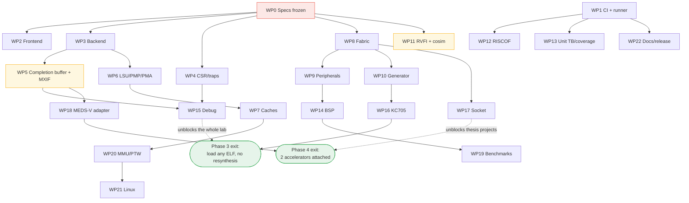
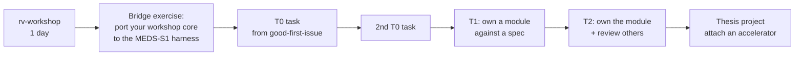
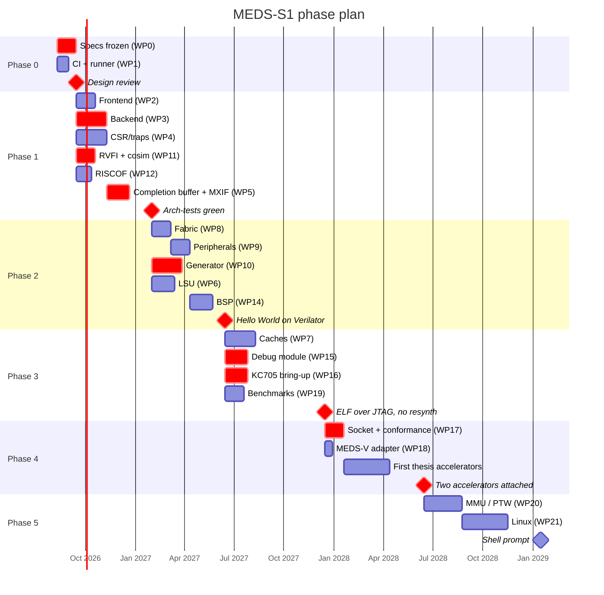

# MEDS-S1 — Execution Plan

**How this project gets built, by whom, in what order**

| | |
|---|---|
| **Version** | 0.1 — DRAFT for lab review |
| **Date** | 2026-08-03 |
| **Owner** | Umer Shahid |
| **Companions** | `specs/MEDS-S1-SPECIFICATION.md`, `specs/SCOPE_CONTRACT.md`, `GITHUB_WORKFLOW.md` |

---

## 1. The three constraints this plan is built around

Everything below follows from these. If a plan ignores them it is a fantasy schedule.

**C1 — Contributors are part-time and rotate.** Mentees have coursework. MS students graduate in
18–24 months. Anyone who is load-bearing today will be gone within two years. **Therefore:** every
work package has an owner *and* a named backup, every module has a written spec, and no task is
sized larger than one semester.

**C2 — Skill level is bimodal.** A few people can implement a completion buffer. Most have finished
`rv-workshop` and can write a testbench or a driver. **Therefore:** work is tiered (§4), and the
tiers are a ladder, not a label.

**C3 — Integration is where projects die.** Ten modules that each work and have never been wired
together is a failure, not 90% progress. **Therefore:** there is a permanent integrator role, CI is
green from before the RTL exists, and every phase ends with something that *runs*.

---

## 2. Roles

| Role | Count | Commitment | Who |
|---|---|---|---|
| **Platform architect** | 1 | ~8 h/wk | Umer Shahid |
| **Faculty sponsor** | 1 | reviews | Dr. Tahir |
| **Tech lead / integrator** | 1 | ~30 h/wk | senior student or RA — **hire/assign before Phase 1** |
| **Verification lead** | 1 | ~20 h/wk | a *dedicated* person, never "whoever is free" |
| **Module owners** | 4–6 | ~10 h/wk | T2 contributors |
| **Contributors** | 4–10 | ~6 h/wk | T0–T1 mentees |
| **Infra owner** | 1 | ~3 h/wk | owns the CI runner box; may be the tech lead |

### 2.1 The two hires that matter

**Tech lead / integrator.** Owns the top level, the generator, and "does it all still work". Without
this role the architect becomes the integrator and stops architecting. This is the single highest-
value position on the project. Fill it before Phase 1 starts.

**Verification lead.** `design_doc.md` §9 already names "verification treated as a phase, not a
discipline" as a top risk. The mitigation is a person, not a policy. This person owns the CI gate and
has authority to block merges. If nobody has that authority, the gate does not exist.

### 2.2 Ownership map (fill in at the Phase-0 review — no blanks allowed)

| Area | Owner | Backup |
|---|---|---|
| Interfaces (`INTERFACES.md`) | Umer | tech lead |
| Core frontend | | |
| Core backend | | |
| CSR / traps / privilege | | |
| Completion buffer + MXIF port | | |
| LSU / PMP / PMA | | |
| Caches | | |
| Fabric | | |
| Peripherals | | |
| Generator | tech lead | |
| Verification harness | verification lead | |
| BSP / software | | |
| FPGA / boards | | |
| MEDS-V adapter | MEDS-V owner | |
| CI infrastructure | infra owner | |

---

## 3. Work packages

Twenty-two packages. Each is one owner, a written spec, a testbench, and a merge gate.

| WP | Title | Depends on | Size | Tier | Phase |
|---|---|---|---|---|---|
| **WP0** | Specs frozen: `INTERFACES`, `ISA_SPEC`, `SCOPE_CONTRACT`, `CODING_STANDARD` | — | 5 wk | T3 | 0 |
| **WP1** | Repo, CI skeleton, lint, runner box, Verilator flow | — | 3 wk | T2 | 0 |
| **WP2** | Core frontend: PC, BTFN, `fetch_req`/`fetch_rsp`, C-expansion | WP0 | 5 wk | T1 | 1 |
| **WP3** | Core backend: decode, regfile, ALU, forwarding, hazards | WP0 | 8 wk | T1/T2 | 1 |
| **WP4** | CSR file (generated), traps, privilege FSM, perf counters | WP0 | 8 wk | T2 | 1 |
| **WP5** | Completion buffer, retire, MXIF port | WP0, WP3 | 6 wk | **T2/T3** | 1 |
| **WP6** | LSU, store buffer, PMP + PMA check unit, AMO/LR-SC | WP0, WP3 | 8 wk | T2 | 1–2 |
| **WP7** | I$ and D$, `Zicbom`, SRAM wrapper | WP6 | 8 wk | T2 | 2–3 |
| **WP8** | AXI fabric, crossbar config, up/downsizers, address decode | WP0 | 5 wk | T1 | 2 |
| **WP9** | Peripherals: CLINT, PLIC, UART, SPI, GPIO, timer | WP8 | 5 wk | **T0/T1** | 2 |
| **WP10** | SoC generator: `soc.yaml` → RTL, ld, headers, DTS, docs | WP0, WP8 | 8 wk | T2 | 2 |
| **WP11** | RVFI port + Spike co-simulation harness | WP0 | 5 wk | **T2** | 1 |
| **WP12** | RISCOF + arch-tests + Sail in CI | WP1 | 4 wk | T1 | 1 |
| **WP13** | Unit TBs, coverage model, random generator | WP1 | ongoing | **T0/T1** | 1+ |
| **WP14** | BSP: crt0, newlib, HAL, `libs1_perf`, `make run` | WP9 | 6 wk | T1 | 2–3 |
| **WP15** | Debug Module + DTM + OpenOCD + semihosting | WP4, WP5 | 6 wk | T2 | 3 |
| **WP16** | KC705 board port, MIG/DDR, bring-up | WP8, WP10 | 6 wk | T2 | 2–3 |
| **WP17** | Accelerator socket + conformance TBs | WP8 | 5 wk | T2 | 3–4 |
| **WP18** | MEDS-V MXIF adapter + book erratum | WP0, WP5 | 2 wk | T2 | 4 |
| **WP19** | Benchmark + workload suite (Tier A and B) | WP14 | 5 wk | **T0/T1** | 2–4 |
| **WP20** | MMU, PTW (2 ports), Sv39, TLB | WP6, WP7 | 10 wk | T2/T3 | 5 |
| **WP21** | OpenSBI + Buildroot Linux | WP20 | 12 wk | T2 | 5 |
| **WP22** | Docs, release engineering, evidence bundle | WP1 | ongoing | T1 | all |

**Bolded tiers** mark the packages worth flagging: WP5 is the hardest and most load-bearing; WP11 is
the highest-value verification investment; WP9, WP13 and WP19 are the best on-ramps for new people.

### 3.1 Dependency graph



**Read the critical path:** WP0 → WP3 → WP5 → WP15 → Phase 3. WP5 (completion buffer + MXIF) is on
it and is also the hardest package. **Assign your strongest person to WP5, and start it early.**

---

## 4. The contribution ladder

| Tier | Entry requirement | What they do | Review | Typical time in tier |
|---|---|---|---|---|
| **T0 — Contributor** | `rv-workshop` completed | add a peripheral via `soc.yaml`, write a HAL driver, write a directed TB, add a benchmark, fix docs | 1 reviewer | 4–8 weeks |
| **T1 — Implementer** | 2 merged T0 PRs | implement a module against a frozen spec | module owner | 1–2 semesters |
| **T2 — Owner** | 1 T1 module delivered *and verified* | own a module and its spec; review T1 work; on-call for their module | tech lead | ongoing |
| **T3 — Architect** | — | own an **interface**; only these people may change `INTERFACES.md` | architect + faculty | ongoing |

### 4.1 The on-ramp



**The bridge exercise is worth building deliberately.** It takes a student's own single-cycle RV32I
from the workshop, wraps it in the platform's memory interface, and runs the platform's RV32I
architectural tests against it. Most will fail, informatively. It is the best possible demonstration
of why the verification harness exists, and it converts a one-day workshop into a recruitment
pipeline. Build it in Phase 2 as part of WP13.

### 4.2 Sizing a task for a mentee

A T0/T1 task must fit in **≤ 20 hours** and be describable in one issue. If it cannot, it is not a
task — it is a work package and needs decomposing. Signs of a badly-sized task:

- "Implement the cache" → too big. → "Implement the D$ tag array with the SRAM wrapper and its unit
  TB" is a task.
- "Improve performance" → not measurable. → "Add a 2-entry store buffer and show the effect on
  Embench with `libs1_perf`" is a task.
- "Help with verification" → not ownable. → "Write the directed TB for the PMA check unit covering
  all six attributes" is a task.

---

## 5. Phase plan

Phases map to university semesters, because that is the unit contributors actually work in.

| Phase | Duration | Deliverable | Exit criterion (binary — no partial credit) |
|---|---|---|---|
| **0. Foundations** | 6 wk | specs frozen, CI green on an empty core, runner racked | Design review passed; `make ci` green; no RTL yet |
| **1. Core** | 1 semester | RV64IM core, M-mode, CSR/traps, CB, RVFI, cosim, RISCOF | RV64I arch-tests green vs Sail; cosim green |
| **2. SoC in simulation** | 1 semester | fabric, peripherals, generator, BSP, Verilator board | "Hello World" from C on Verilator via `make run` |
| **3. Real hardware** | 1 semester | Debug Module, DDR, caches, KC705 | **Load and debug any ELF over JTAG, no resynthesis** |
| **4. Extensibility** | 1 semester | socket, conformance TBs, MEDS-V adapter, workload suite | **Two accelerators attached by two people who did not write the core, zero core RTL changes** |
| **5. Linux** | 2 semesters | S-mode, Sv39, PTW port 1, OpenSBI, Buildroot | Shell prompt on KC705 |
| **6. Research** | ongoing | thesis accelerators, RVV, papers | first thesis defended on the platform |

**Phase 3 is the one that unlocks everyone else in the lab.** Every temptation to defer it should be
resisted. Until it lands, every software change costs a bitstream build and the platform is not yet
useful to anyone but its builders.

### 5.1 Timeline



*Dates assume a start in mid-August 2026 and standard semester breaks. Treat the shape as the plan
and the dates as an estimate to be re-baselined at each phase review.*

---

## 6. Staffing by phase

| Phase | Architect | Tech lead | Verif lead | T2 owners | T0/T1 | Total active |
|---|---|---|---|---|---|---|
| 0 | 1 | 1 | 1 | 2 | 3 | 8 |
| 1 | 1 | 1 | 1 | 4 | 4 | 11 |
| 2 | 1 | 1 | 1 | 4 | 6 | 13 |
| 3 | 1 | 1 | 1 | 4 | 6 | 13 |
| 4 | 1 | 1 | 1 | 3 | 4 + thesis students | 10+ |
| 5 | 1 | 1 | 1 | 3 | 4 | 10 |

**If you cannot staff this, cut scope, not quality.** `SCOPE_CONTRACT.md` §7 has the pre-agreed cut
order, decided in advance precisely so it is not decided at 2 a.m. in week 30.

### 6.1 The minimum viable team

If the lab can only field **four** people: architect (part-time), tech lead, verification lead, and
one strong T2. That team can reach Phase 3 in about 18 months instead of 12, provided scope is cut to
S1-Base with one socket and no MEDS-V integration. **Below four people this project should not
start** — it will produce an unverified core that nobody can extend, which is worse than nothing
because it consumes the lab's credibility for the idea.

---

## 7. Working rhythm

| Cadence | Event | Duration | Who | Output |
|---|---|---|---|---|
| Daily | async standup in a GitHub Discussion thread | — | all | blockers visible |
| Weekly | integration sync | 45 min | tech lead + owners | CI state, blockers, next week |
| Weekly | office hours | 60 min | architect | design questions, unblocking |
| Biweekly | design review of one module | 60 min | owner presents | spec approved before RTL |
| Monthly | demo day | 60 min | all | something running, on hardware if possible |
| Per phase | phase review | 3 h | all + faculty | exit criterion assessed, re-baseline |
| Per semester | ownership review | 60 min | architect | ownership map updated for departures |

**Rules that make this work:**

1. **Demo day is non-negotiable and requires something running.** Slides do not count. A monthly
   forcing function for integration is the cheapest defence against C3.
2. **Design review before RTL, always.** A module owner presents the spec and the testbench plan. The
   review approves the *spec*, not the code. Catching a design error here costs an hour; catching it
   in integration costs a month.
3. **Blockers are raised the same day.** A mentee blocked for a week has lost a sixth of a semester.

---

## 8. Definition of done for a work package

A WP is not done because the RTL exists. All of these:

- ☐ Spec in `docs/specs/<module>.md`, reviewed
- ☐ RTL merged, Verible lint clean
- ☐ Unit testbench in CI, passing
- ☐ `README.md` in the module directory stating the interface contract (NFR-7)
- ☐ Integrated into at least one named config and elaborating in CI
- ☐ Coverage contribution measured
- ☐ Owner and backup recorded in the ownership map
- ☐ Demoed at a demo day

---

## 9. Risk register

| # | Risk | Likelihood | Impact | Mitigation | Owner |
|---|---|---|---|---|---|
| R1 | Tech lead not hired; architect becomes integrator and stops architecting | **high** | **high** | Fill before Phase 1. Treat as a Phase-0 exit blocker. | Umer |
| R2 | Verification treated as a phase; CI red for weeks | high | **high** | Dedicated verification lead with merge-block authority; CI green before RTL exists | verif lead |
| R3 | Scope creep into superscalar/OoO | medium | high | `SCOPE_CONTRACT.md` signed; changes need a design review | architect |
| R4 | Interfaces changed after accelerators attach | medium | **very high** | Version + freeze + conformance TBs; only T3 may edit `INTERFACES.md` | architect |
| R5 | Student turnover erases knowledge | **certain** | high | Docs-as-code, named backups, public repo, ≤1-semester tasks | all owners |
| R6 | Phase 3 deferred; everyone resynthesises for months | medium | **high** | Phase 3 is a hard priority; WP15/WP16 staffed with T2s | tech lead |
| R7 | CI runner box not procured; nightly synthesis never runs | medium | medium | Phase-0 line item with a named owner and a purchase order | infra owner |
| R8 | WP5 (completion buffer + MXIF) underestimated — it is on the critical path *and* hardest | **high** | **high** | Strongest person; start early; formal liveness properties (§9.4 of spec) from day one | tech lead |
| R9 | MEDS-V and MEDS-S1 diverge; adapter never written | medium | high | WP18 scheduled in Phase 4 with a named owner; erratum raised in Phase 0 | MEDS-V owner |
| R10 | First thesis student blocked because the socket is late | medium | high | WP17 finishes before thesis intake; socket conformance TB ships with it | tech lead |
| R11 | Nobody can reproduce a result a year later | medium | medium | `platform.lock`, tagged releases, `make`-reproducible numbers (spec §34) | verif lead |
| R12 | Vivado licence does not permit headless batch CI | low | medium | Verify in Phase 0, before the box is specced | infra owner |

**R1, R2 and R8 are the ones that actually sink this project.** They are all staffing decisions, and
all three are decidable in Phase 0.

---

## 10. Phase 0, week by week

The only part of this plan detailed to the week, because it is the part that must not drift.

| Wk | Deliverable | Owner | Gate |
|---|---|---|---|
| 1 | Name ratified. Repo created, licence, SPDX, `CITATION.cff`. Tech lead and verification lead **assigned**. CI runner box specced; Vivado batch licence verified (R12). | Umer | — |
| 1–2 | `specs/INTERFACES.md` v1.0 candidate: MXIF-1.0, two-phase completion, memory model M2/M3, RVFI + RVFI-V, socket | Umer + tech lead | |
| 1–2 | Three contributors read and present **CVA6, Ibex, Rocket** — structure, not code. 45 min each. | 3 × T1 | presentations delivered |
| 2–3 | `specs/ISA_SPEC.md`: exact instruction list, CSR list, PMA table, counter events | T2 | |
| 2–3 | `SCOPE_CONTRACT.md` argued line by line and **signed** | all | signatures collected |
| 3 | `CODING_STANDARD.md` + Verible config + Verilator flow + RISCOF skeleton, **green on an empty core** | verif lead | `make ci` green |
| 3–4 | `soc.yaml` schema v0.1; generator emits a memory map and C header from YAML | tech lead | golden test passes |
| 4 | Bandwidth budget (spec §18.3) and PMA table (spec §11) ratified | Umer | |
| 4 | MEDS-V erratum raised against book Ch 8.4 and Appendix E | MEDS-V owner | issue open |
| 5 | Ownership map filled with **no blanks**. Runner box racked and running CI. | Umer + infra | |
| 5 | **Design review** — 3 h, with Dr. Tahir and one external reviewer. Ratify the 24-row decision log. | all | decision log signed |
| 6 | Freeze. Tag `v0.1.0-spec`. **First RTL commit.** | — | — |

**No RTL is written for five weeks. This is correct.** The most expensive possible outcome is a
working RV64I core in week 6 that nothing can attach to.

### 10.1 Phase 0 exit criteria

- ☐ `INTERFACES.md` frozen at v1.0, signed by all module owners
- ☐ `SCOPE_CONTRACT.md` signed by all six signatories
- ☐ `ISA_SPEC.md` and `CODING_STANDARD.md` merged
- ☐ CI green on an empty core: lint, elaborate, RISCOF skeleton, Verilator
- ☐ CI runner box operational; nightly job runs (even if it does nothing yet)
- ☐ Tech lead and verification lead assigned by name
- ☐ Ownership map complete, no blanks
- ☐ Decision log ratified
- ☐ MEDS-V erratum raised

**All nine, or Phase 1 does not start.**

---

## 11. Onboarding a new contributor

The target is **half a day from clone to first green CI run**, and it is tested every cohort (NFR-9).

```
Day 1  ☐ Read: README, SCOPE_CONTRACT §2-3, spec Part I, CODING_STANDARD
       ☐ Clone, `make setup`, `make verilate`, `make run BOARD=verilator PROG=hello`
       ☐ Pick a `good-first-issue`
Day 2  ☐ Branch, implement, `make ci` locally green
       ☐ Open PR against the issue; CI green; address review
Week 2 ☐ PR merged. Second task assigned.
Week 4 ☐ Two merged PRs → T1. Assigned a module with a spec.
```

If any step takes materially longer than this, **that is a defect in the platform's documentation,
not in the contributor.** Log it as an issue against WP22 and fix it. The onboarding path is a
product feature, and the lab's ability to absorb each new cohort depends on it entirely.

---

## 12. Continuity across cohorts

C1 says everyone leaves. Plan for it explicitly:

1. **Handover is a deliverable.** Departing owners write a handover note in their module's
   `README.md`: current state, known issues, what they would do next, where the bodies are buried.
2. **The backup runs the handover review**, not the architect. If the backup cannot, the backup was
   nominal and the ownership map was fiction.
3. **Every semester's ownership review** reassigns anything whose owner is within two months of
   leaving.
4. **Every new cohort's first assignment is a platform contribution**, not a toy project. That is how
   the "binding factor" actually happens rather than being aspirational.
5. **The 18-month test:** a design review happens correctly with the architect present but silent.
   Until that is true, the bus factor is 1 and every mitigation above is theatre.

---

## 13. Success metrics

Tracked publicly, reviewed each phase. Metrics the project is judged on, not vanity numbers.

| Metric | Phase 3 target | Phase 6 target |
|---|---|---|
| Contributors with ≥1 merged PR | 10 | 30 |
| Accelerators attached, not by core authors | 0 | 6 |
| Theses completed on the platform | 0 | 4 |
| Time from clone to first green CI run | < 1 day | < 4 h |
| Time from `soc.yaml` edit to running on FPGA | < 1 h | < 30 min |
| CI green fraction over the phase | > 90% | > 95% |
| Arch-test pass rate | 100% | 100% |
| Publications | 0 | 3 + a Summit talk |
| Bus factor on any single module | ≥ 2 | ≥ 2 |

**"Accelerators attached, not by core authors" is the metric that actually measures whether MEDS-S1
became a platform.** Everything else can look healthy while the project remains one person's core.
