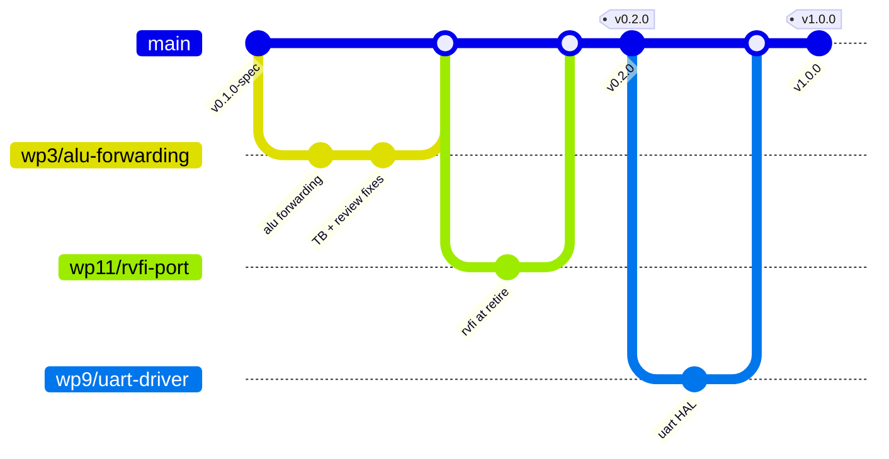

# MEDS-S1 — GitHub Workflow

**How the project lives on GitHub: repos, branches, issues, CI, releases, and the rules that make a
rotating team of part-time contributors produce a coherent platform.**

| | |
|---|---|
| **Version** | 0.1 — DRAFT |
| **Date** | 2026-08-03 |
| **Companions** | `EXECUTION_PLAN.md`, `specs/MEDS-S1-SPECIFICATION.md` |

---

## 1. Principles

1. **The repo is the project.** Not a shared drive, not a WhatsApp group, not one laptop. If it is
   not in git it does not exist.
2. **Public from commit one.** Apache-2.0, `meds-uet` org. Public visibility disciplines quality and
   builds the MEDS name. It also means a graduating student's work survives them.
3. **`main` is always green and always releasable.** Enforced by branch protection, not by asking.
4. **Everything is traceable:** requirement → issue → branch → PR → commit → release.
5. **Automate the rules.** A rule a human has to remember is a rule that gets skipped in week 30.

---

## 2. Repository structure

```
github.com/meds-uet/
├── meds-s1                    ← the platform monorepo (primary)
├── meds-v                     ← vector coprocessor (exists; submodule of meds-s1)
├── meds-s1-accelerators       ← accelerator template + thesis accelerators
├── rv-workshop                ← the on-ramp (exists)
└── .github                    ← org-wide issue templates, profile, workflows
```

### 2.1 Why a monorepo for the platform

One CI run must be able to prove that the core, fabric, generator, BSP and boards all work
*together*. Splitting them across repos makes that impossible without a fragile cross-repo pipeline —
and the failure mode (six green repos and a broken platform) is exactly C3 in the execution plan.

Accelerators live outside because they have independent lifecycles, different authors, and sometimes
publication embargoes.

### 2.2 Monorepo layout

```
meds-s1/
├── README.md                  ← what it is, who it's for, quickstart
├── LICENSE                    ← Apache-2.0
├── CITATION.cff               ← so the platform is citable
├── CODEOWNERS
├── platform.lock              ← tested hash of every submodule
├── Makefile                   ← the single entry point
├── docs/
│   ├── specs/                 ← INTERFACES.md, ISA_SPEC.md, SCOPE_CONTRACT.md, spec
│   ├── modules/               ← per-module design docs
│   ├── reviews/               ← signed review records
│   └── onboarding/
├── rtl/
│   ├── core/                  ← S1-Core: frontend, backend, csr, cb, lsu
│   ├── cache/
│   ├── fabric/
│   ├── peripherals/
│   ├── socket/                ← meds_s1_accel_socket
│   ├── common/                ← meds_sram_wrapper, CDC, FIFOs
│   └── generated/             ← DO NOT EDIT; checked in so diffs are visible
├── gen/                       ← the Python generator
├── configs/                   ← s1_nano.yaml, s1_base.yaml, s1_ai.yaml, s1_linux.yaml
├── boards/
│   ├── verilator/             ← board.yaml, board_top.sv, openocd.cfg
│   └── kc705/                 ← + board.xdc
├── sw/
│   ├── bsp/                   ← crt0, newlib stubs, HAL, libs1_perf
│   ├── apps/                  ← hello, benchmarks, workloads
│   └── drivers/
├── verif/
│   ├── unit/                  ← per-module TBs
│   ├── cosim/                 ← Spike comparison harness
│   ├── riscof/                ← arch-test config
│   ├── formal/                ← riscv-formal + SVA properties
│   ├── conformance/           ← tb_mxif_conformance, tb_socket_conformance
│   └── coverage/
├── extensions/
│   ├── REGISTRY.md            ← opcode, CSR, accelerator-ID allocations
│   └── <name>/                ← the 7-item checklist per extension
├── ext/                       ← submodules: meds-v, axi, common_cells, riscv-dbg
└── .github/
    ├── workflows/
    ├── ISSUE_TEMPLATE/
    ├── PULL_REQUEST_TEMPLATE.md
    └── CODEOWNERS
```

### 2.3 Submodules and `platform.lock`

Submodules are pinned by hash. `platform.lock` records the hash of each, plus the toolchain versions
that the release was tested with:

```yaml
# platform.lock -- regenerated by CI, committed on release
platform_version: 1.2.0
tested: 2027-11-04
submodules:
  meds-v:        a3f91c2
  axi:           7d2e114
  common_cells:  9b01ee7
  riscv-dbg:     4c88f20
toolchain:
  gcc:       riscv64-unknown-elf-gcc 14.2.0
  verilator: 5.028
  spike:     1.1.1-dev g8a2f31
  sail:      0.18
  vivado:    2024.2
```

This file is why a result from 2027 can be reproduced in 2031. **Every number in every thesis cites
a `platform.lock`.**

---

## 3. Branching model

Trunk-based with short-lived branches. Nothing more elaborate — release branches and long-lived
develop branches create merge debt that a part-time team cannot service.



| Rule | Value |
|---|---|
| Branch naming | `wp<N>/<short-description>` — e.g. `wp5/completion-buffer` |
| Branch lifetime | **≤ 2 weeks.** Longer means the task was mis-sized (execution plan §4.2) |
| Merge strategy | **Squash merge.** One issue = one commit on `main` |
| Rebase vs merge | Rebase onto `main` before merging; no merge commits from `main` into branches |
| Force push | Allowed on your own branch, never on `main` |
| Release | Tag on `main`. No release branches until v1.0 ships and needs backports |

### 3.1 Commit messages

```
wp5: add completion buffer retire logic

Implements the retire rule of SPEC section 9.2, including the
two-phase MXIF path (norollback gates retire; result gates
retire only when rd_we).

Closes #142
```

Prefix with the WP. Reference the issue. CI enforces the prefix and the issue reference.

---

## 4. Branch protection on `main`

Configure these on day one. They are the difference between a disciplined project and a hopeful one.

| Setting | Value | Why |
|---|---|---|
| Require PR before merge | ✅ | no direct pushes, including by the architect |
| Required approvals | 1 (2 for `rtl/core/`, `docs/specs/`, `.github/`) | interfaces need more eyes |
| Dismiss stale approvals on push | ✅ | approval applies to reviewed code |
| Require review from CODEOWNERS | ✅ | the ownership map has teeth |
| Required status checks | `lint`, `elaborate`, `unit`, `archtest`, `cosim`, `bench` | the CI gate |
| Require branches up to date | ✅ | prevents "green in isolation, broken on main" |
| Require conversation resolution | ✅ | review comments cannot be ignored |
| Require linear history | ✅ | squash-merge only |
| Include administrators | ✅ | **especially the architect** |
| Allow force push | ❌ | |
| Allow deletions | ❌ | |

> **"Include administrators" is the one people disable first and regret most.** If the architect can
> bypass the gate at 11 p.m. before a demo, the gate does not exist, and everyone learns that.

---

## 5. CODEOWNERS

```
# .github/CODEOWNERS
# Falls through top to bottom; last match wins.

*                           @meds-uet/maintainers

/docs/specs/                @umershahidengr @meds-uet/architects
/docs/specs/INTERFACES.md   @umershahidengr
/rtl/core/                  @meds-uet/core-team
/rtl/core/cb/               @meds-uet/core-team @umershahidengr
/rtl/socket/                @meds-uet/architects
/rtl/fabric/                @meds-uet/soc-team
/rtl/peripherals/           @meds-uet/soc-team
/gen/                       @meds-uet/tech-lead
/verif/                     @meds-uet/verif-team
/verif/conformance/         @meds-uet/architects
/sw/                        @meds-uet/sw-team
/boards/                    @meds-uet/soc-team
/extensions/REGISTRY.md     @umershahidengr
/.github/                   @meds-uet/tech-lead
platform.lock               @meds-uet/tech-lead
```

**`INTERFACES.md`, `/rtl/core/cb/`, `/rtl/socket/`, `/verif/conformance/` and `REGISTRY.md` are the
frozen surfaces.** They require an architect's review because changing them breaks every attached
accelerator. This file is where the T3 tier from the execution plan becomes enforceable.

---

## 6. Issues

### 6.1 Templates

Five, in `.github/ISSUE_TEMPLATE/`:

| Template | For | Key required fields |
|---|---|---|
| `bug.yml` | something is broken | config, board, repro steps, expected vs actual, `platform.lock` |
| `task.yml` | a T0/T1 unit of work | WP, spec reference, acceptance criteria, **estimated hours (≤20)** |
| `module.yml` | a T1/T2 module implementation | spec link, interface contract, TB plan, owner, backup |
| `accelerator.yml` | a thesis accelerator proposal | the §33.4 four-question checklist |
| `interface-change.yml` | change to a frozen interface | affected implementers, migration plan, deprecation window |

The `accelerator.yml` template is the one that shapes the research programme. It requires, in
writing, before any RTL:

1. Coupling mechanism and why (spec §21 flowchart)
2. **The bandwidth calculation** (spec §22.4) — required vs available
3. Target workloads from the frozen suite (spec §32) and their measured scalar baselines
4. What the honest negative result would look like

### 6.2 Labels

```
Type      type:bug  type:feature  type:task  type:module  type:docs
          type:infra  type:interface-change  type:accelerator
Work pkg  wp:0 … wp:22
Tier      tier:T0  tier:T1  tier:T2  tier:T3
Area      area:core  area:cache  area:fabric  area:periph  area:socket
          area:verif  area:sw  area:fpga  area:generator
Priority  prio:blocker  prio:high  prio:normal  prio:low
Status    status:blocked  status:needs-spec  status:needs-review  status:wip
Special   good-first-issue   help-wanted   breaking-change   phase-exit
```

`tier:T0` + `good-first-issue` is the onboarding queue. **Keep at least five open at all times.**
That is a standing responsibility of the tech lead, not a nice-to-have — a new contributor who
arrives to an empty queue loses their first week and often does not come back.

### 6.3 Milestones

One per phase, matching `EXECUTION_PLAN.md` §5:

`Phase 0 — Foundations` · `Phase 1 — Core` · `Phase 2 — SoC in simulation` ·
`Phase 3 — Real hardware` · `Phase 4 — Extensibility` · `Phase 5 — Linux`

Each milestone's description contains the **exit criterion**, verbatim. Phase-exit issues are
labelled `phase-exit` and must all close before the phase review.

---

## 7. GitHub Projects board

One org-level Project, board + table views.

**Columns:** `Backlog` → `Ready` → `In progress` → `In review` → `Blocked` → `Done`

**Custom fields:**

| Field | Type | Use |
|---|---|---|
| Work package | single-select WP0–WP22 | groups the roadmap view |
| Tier | single-select T0–T3 | matches tasks to people |
| Estimate (h) | number | enforces the ≤20 h rule |
| Owner | person | |
| Backup | person | continuity (execution plan §12) |
| Phase | single-select | |
| Blocked by | text | surfaces the critical path |

**Views to create:**

- **Roadmap** — grouped by WP, filtered to the current phase. The tech lead's weekly view.
- **My work** — assigned to me, not Done.
- **Onboarding** — `tier:T0` + `good-first-issue`, unassigned. Linked from the README.
- **Blocked** — status `Blocked`. Reviewed at every weekly sync; nothing sits here two weeks.
- **Critical path** — WP0, WP3, WP5, WP11, WP15, WP16. Reviewed weekly by the architect.

Automate: issue opened → `Backlog`; assigned → `In progress`; PR opened → `In review`; PR merged →
`Done`.

---

## 8. Pull requests

### 8.1 Template

```markdown
## What
One or two sentences.

## Why
Closes #___

## Spec reference
Which section of SPEC / INTERFACES this implements or changes.

## Checklist
- [ ] Lint clean (`make lint`)
- [ ] Unit TB added or updated, passing
- [ ] All four configs elaborate
- [ ] Module `README.md` updated (NFR-7)
- [ ] Generated files regenerated if `soc.yaml` schema changed
- [ ] No change to a frozen interface — or `type:interface-change` issue linked
- [ ] Benchmark impact: none / measured below

## Benchmark impact
CoreMark/MHz before → after:
```

### 8.2 Review policy

| Change touches | Approvals | Reviewer |
|---|---|---|
| docs, tests, apps | 1 | anyone T1+ |
| a module's internals | 1 | module owner |
| `rtl/core/`, `gen/` | 2 | module owner + tech lead |
| a frozen interface | 2 | architect + every affected implementer |
| `platform.lock`, `.github/` | 1 | tech lead |

**Review SLA: 48 hours.** A part-time contributor blocked on review for a week has lost a sixth of
their semester. If a reviewer cannot meet it, they reassign — silence is not an acceptable review.

### 8.3 Review guidance for a teaching lab

Reviews are the main teaching mechanism, so:

- **Distinguish blocking from non-blocking.** Prefix optional comments with `nit:` or `suggestion:`.
- **Explain the why, and cite the spec section.** "Move this to the socket, per SPEC §20.1 — CDC does
  not go in accelerator RTL" teaches; "wrong place" does not.
- **Approve with comments** when nothing is blocking. Holding a PR for style is how you lose people.
- **Never rewrite a contributor's branch yourself** to "just fix it". They learn nothing and stop
  contributing. Comment, and let them push.

---

## 9. CI

### 9.1 Workflows

| Workflow | Trigger | Runner | Budget | Jobs |
|---|---|---|---|---|
| `pr.yml` | PR, push | self-hosted | **< 20 min** (NFR-3) | lint, elaborate ×4, unit, archtest, cosim, bench |
| `nightly.yml` | 02:00 daily | self-hosted | < 4 h | random regression, formal, synthesis, timing, area, coverage |
| `release.yml` | tag `v*` | self-hosted | < 6 h | all configs, full arch-test, evidence bundle, artefacts |
| `docs.yml` | PR touching `docs/` | GitHub-hosted | < 2 min | link check, module-README presence check |
| `submodule-bump.yml` | weekly | self-hosted | < 30 min | test latest MEDS-V, open a PR if green |

### 9.2 `pr.yml` — the merge gate

```yaml
name: PR
on: [pull_request, push]

jobs:
  lint:
    runs-on: [self-hosted, meds-ci]
    steps:
      - uses: actions/checkout@v4
        with: { submodules: recursive }
      - run: make lint            # Verible: rules + format + CDC

  elaborate:
    runs-on: [self-hosted, meds-ci]
    strategy:
      matrix:
        config: [s1_nano, s1_base, s1_ai, s1_linux]
    steps:
      - uses: actions/checkout@v4
        with: { submodules: recursive }
      - run: make elaborate CONFIG=${{ matrix.config }}
      - run: make check-generated CONFIG=${{ matrix.config }}   # regenerate, diff must be empty

  unit:
    runs-on: [self-hosted, meds-ci]
    steps:
      - uses: actions/checkout@v4
        with: { submodules: recursive }
      - run: make test-unit
      - uses: actions/upload-artifact@v4
        if: always()
        with: { name: unit-logs, path: verif/unit/logs/ }

  archtest:
    runs-on: [self-hosted, meds-ci]
    steps:
      - uses: actions/checkout@v4
        with: { submodules: recursive }
      - run: make riscof CONFIG=s1_base        # vs Sail
      - uses: actions/upload-artifact@v4
        with: { name: riscof-report, path: verif/riscof/report/ }

  cosim:
    runs-on: [self-hosted, meds-ci]
    steps:
      - uses: actions/checkout@v4
        with: { submodules: recursive }
      - run: make cosim CONFIG=s1_base         # every retired instr vs Spike over RVFI

  bench:
    runs-on: [self-hosted, meds-ci]
    steps:
      - uses: actions/checkout@v4
        with: { submodules: recursive }
      - run: make bench CONFIG=s1_base
      - run: make bench-compare BASELINE=origin/main   # fails on >3% regression (NFR-10)
      - uses: actions/upload-artifact@v4
        with: { name: bench-results, path: bench/results.json }
```

**`make check-generated` is the quiet hero.** It regenerates everything from `soc.yaml` and fails if
the checked-in output differs. That single job is what stops the memory map from being correct in the
RTL and wrong in the device tree — the bug class that costs a week and teaches nothing.

### 9.3 Self-hosted runner

Required for Vivado (execution plan R7, R12) and for keeping the PR gate under 20 minutes.

| Item | Spec | Note |
|---|---|---|
| CPU | ≥ 16 cores | Verilator build and synthesis both parallelise |
| RAM | 64 GB | Vivado on a 45 k-LUT design |
| Disk | 1 TB NVMe | build artefacts, toolchains, ccache |
| OS | Ubuntu LTS | matches contributors' environments |
| Software | Verilator, Spike, Sail, RISCOF, riscv-gcc, Vivado, OpenOCD | pinned versions in `platform.lock` |
| Licence | Vivado permitting **headless batch** | **verify in Phase 0, before purchase** |
| Owner | infra owner, by name | |

Label the runner `[self-hosted, meds-ci]`. Register it at the **org** level so accelerator repos can
use the same box.

Toolchains are installed in a container image built from `ci/Dockerfile`, versioned in the repo, so a
runner rebuild is reproducible and a contributor can run the exact CI environment locally:

```
$ make ci-local     # runs the PR gate in the same container
```

That command is what makes "CI is red and I can't reproduce it" a non-problem.

### 9.4 Nightly

Synthesis, timing, area, formal, random regression, and full coverage. Results are appended to a
tracked JSON history and plotted into `docs/trends/`. **f_max and CoreMark/MHz over time are plotted
in the README.** A slow decline across a semester is the normal failure mode and is only visible if
it is plotted.

---

## 10. Releases

Tag on `main`: `v<major>.<minor>.<patch>`. `release.yml` attaches the **evidence bundle**
(spec §28.6):

```
meds-s1-v1.0.0/
├── platform.lock
├── riscof-report.html            per-test, per-config
├── cosim-summary.txt             instructions compared
├── formal-results.txt
├── coverage-report.html
├── synthesis/
│   ├── utilization.rpt           LUT/FF/BRAM/DSP per config
│   └── timing.rpt                achieved f_max, critical path
├── benchmarks.json               + history
├── bitstreams/kc705_s1_base.bit
└── docs/                         rendered spec, interfaces, memory map
```

**"The open academic core that ships with its own compliance evidence" is only a claim if this bundle
is downloadable.** Publish it on every release, including pre-1.0 ones.

Also on release: mint a **Zenodo DOI** (via the GitHub–Zenodo integration) so the platform is
citable, and update `CITATION.cff`.

---

## 11. Accelerator repos

Thesis accelerators live in `meds-s1-accelerators` (or a student's own repo for embargoed work), and
are integrated by hash, never by copy.

```
meds-s1-accelerators/
├── template/                  ← copy this to start
│   ├── rtl/accel_top.sv       ← cfg slave + dma master + irq, per SPEC §20
│   ├── sw/driver.c            ← cache maintenance already correct
│   ├── verif/tb_accel_unit.sv
│   ├── accel.yaml             ← ID, version, register map, bandwidth demand
│   └── README.md              ← incl. the §22.4 calculation
├── meds-x-conv/
├── meds-x-fft/
└── REGISTRY.md                ← accelerator ID allocations
```

**Every accelerator's CI runs `tb_socket_conformance` from the platform repo** before anything else.
An accelerator that fails conformance is not integrated, regardless of how well its datapath works.
This is the mechanism that stops accelerator #7 from breaking assumptions accelerator #3 relied on.

Attaching one to the platform is a `soc.yaml` change plus a submodule pin — a small, reviewable PR:

```yaml
sockets:
  - id: 0
    ip: meds-x-conv
    rev: 8c41f0a
    base: 0x2000_0000
    irq: 16
    bandwidth_gbps: 2.4     # generator checks this against SPEC §18.3
```

---

## 12. Discussions and documentation

| Channel | Use |
|---|---|
| **Issues** | anything with a deliverable |
| **Discussions → Q&A** | "how do I…", "why is…" — searchable, unlike chat |
| **Discussions → Design** | proposals before they become interface-change issues |
| **Discussions → Standup** | one thread per week, async daily updates |
| **Discussions → Show and tell** | demo day writeups, thesis results |
| **`docs/`** | anything normative. **Docs-as-code, reviewed like code.** |
| **Wiki** | ❌ **not used** — it is unreviewed, unversioned with the code, and rots |

Chat (Slack/WhatsApp) is for coordination only. **Any decision made in chat is written into an issue
or a doc the same day, or it did not happen.** This is the single rule that most protects against
C1 (contributors rotate) — a decision that lives only in a chat scrollback is lost the moment the
people in that chat graduate.

---

## 13. Setup checklist (Phase 0, week 1)

- ☐ Create `meds-uet/meds-s1`, public, Apache-2.0
- ☐ Teams: `architects`, `maintainers`, `core-team`, `soc-team`, `verif-team`, `sw-team`
- ☐ `CODEOWNERS` (§5)
- ☐ Branch protection on `main` (§4), **including administrators**
- ☐ 5 issue templates + `PULL_REQUEST_TEMPLATE.md` (§6.1, §8.1)
- ☐ Label set (§6.2), created by script so it is reproducible
- ☐ 6 milestones with exit criteria in the descriptions (§6.3)
- ☐ Project board with fields, views, and automation (§7)
- ☐ Self-hosted runner registered at org level, labelled `meds-ci` (§9.3)
- ☐ `ci/Dockerfile` + `make ci-local`
- ☐ `pr.yml` green on an empty core
- ☐ `CITATION.cff`, `README.md`, `CONTRIBUTING.md`, `CODE_OF_CONDUCT.md`
- ☐ Zenodo integration enabled
- ☐ Submodules added and pinned; `platform.lock` generated
- ☐ **5 `good-first-issue`s open**
- ☐ Discussions enabled with the five categories; Wiki disabled

---

## 14. The rules, one page

Print this.

1. `main` is always green. Nothing merges red. **This applies to the architect.**
2. Every change is a PR. Every PR closes an issue. Every issue belongs to a work package.
3. Branches live ≤ 2 weeks. Longer means the task was mis-sized.
4. Review within 48 hours, or reassign.
5. Frozen interfaces (`INTERFACES.md`, socket, MXIF, conformance TBs, `REGISTRY.md`) change only via
   an `interface-change` issue with an architect's approval and a migration plan.
6. Generated files are checked in and CI verifies they match `soc.yaml`.
7. Every module has a `README.md` with its interface contract. No merge without it.
8. A performance regression > 3% blocks merge without written justification.
9. Decisions made in chat are written down the same day, or they did not happen.
10. Five `good-first-issue`s are open at all times.
11. Every release ships the evidence bundle.
12. Every number in a thesis cites a `platform.lock` and is regenerable by `make`.
