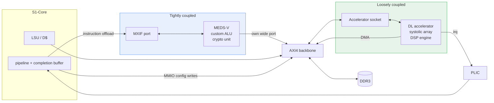
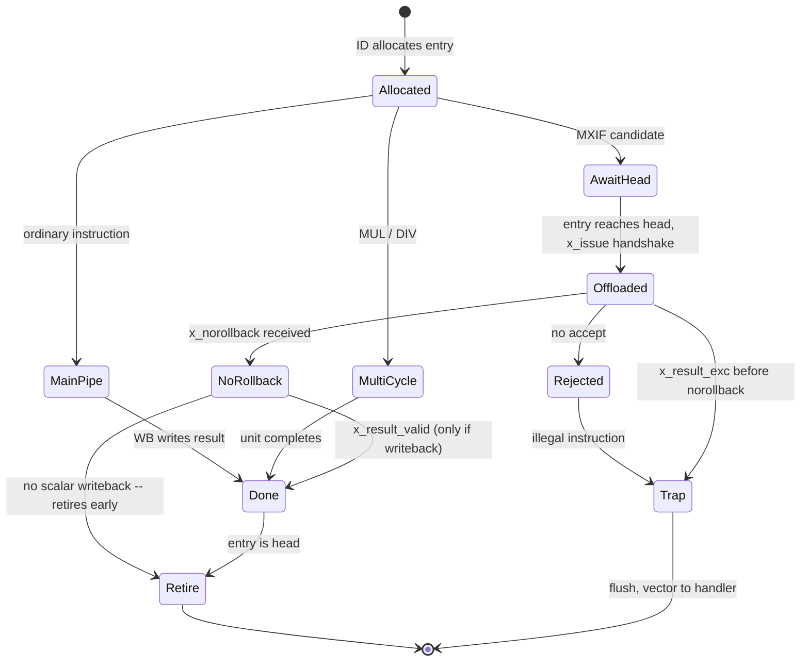
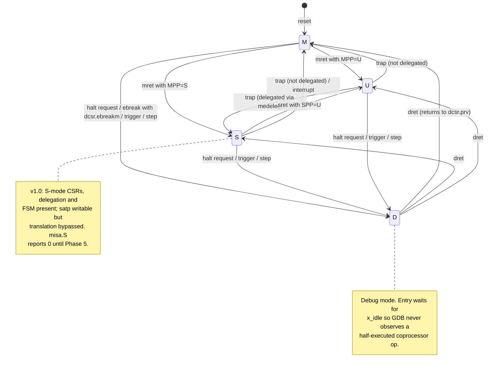
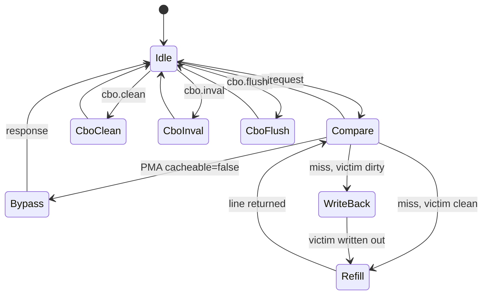
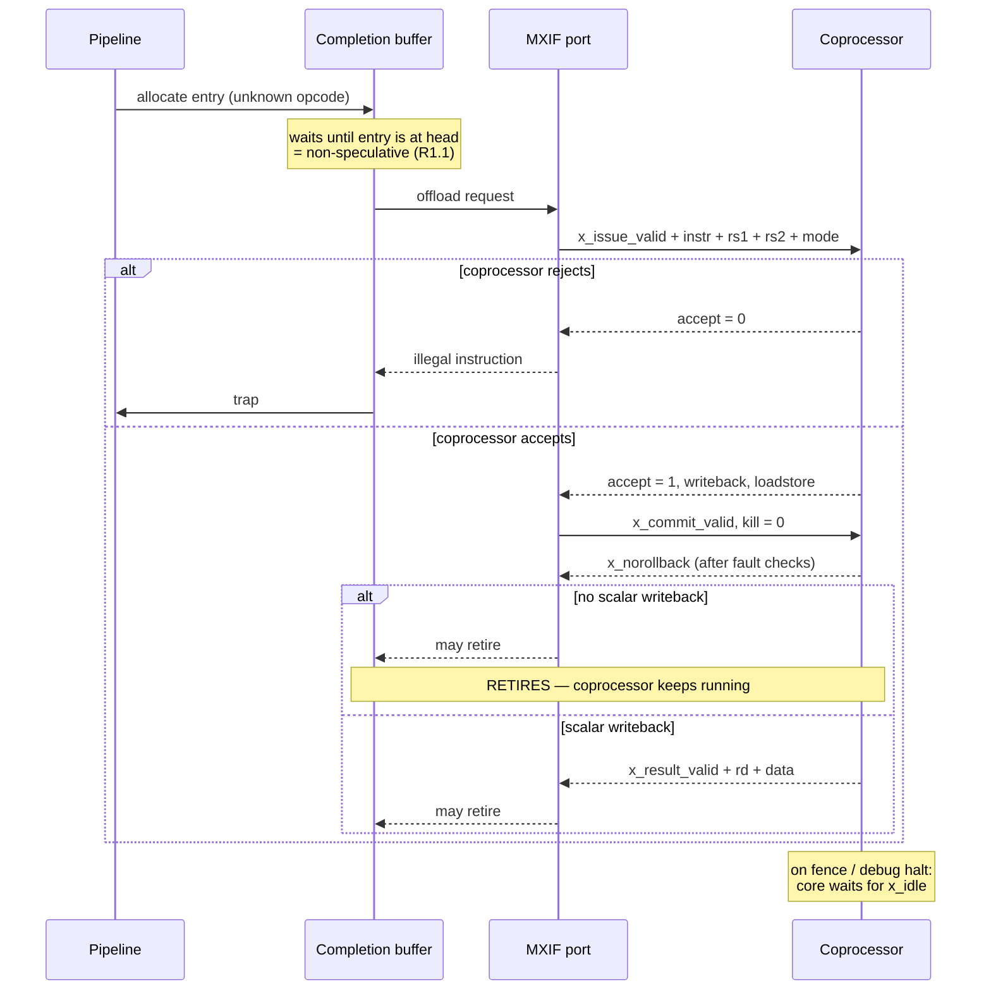
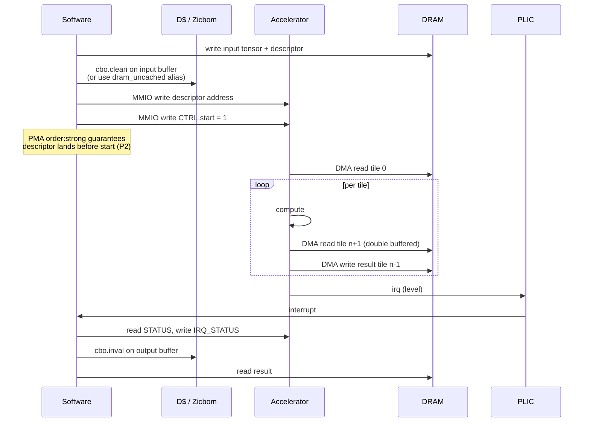
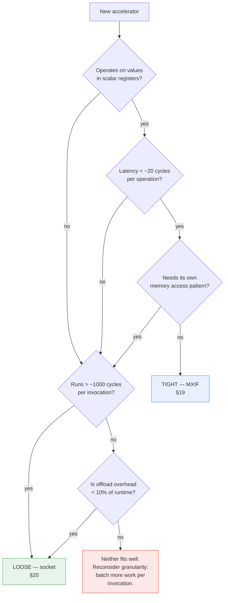
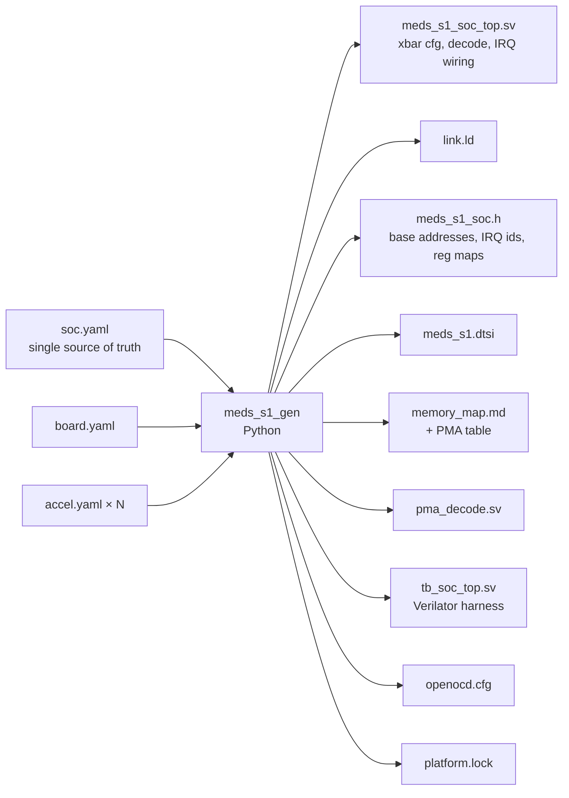

# MEDS-S1 — Platform Specification

**An open RISC-V SoC platform for accelerator research**
Maktab-e-Digital Systems (MEDS), UET Lahore · Apache-2.0

| | |
|---|---|
| **Version** | 0.2 — DRAFT for stakeholder review |
| **Date** | 2026-08-03 |
| **Architect** | Umer Shahid |
| **Status** | Pre-RTL. Freeze target: end of Phase 0 |
| **Companions** | `INTERFACES.md` (normative), `SCOPE_CONTRACT.md` (v1.0 boundary), `../ADDENDUM.md` (rationale), `../EXECUTION_PLAN.md`, `../GITHUB_WORKFLOW.md` |

---

## Contents

**Part I — The platform**
[1. Purpose](#1-purpose) · [2. Stakeholders and use cases](#2-stakeholders-and-use-cases) ·
[3. Requirements](#3-requirements) · [4. System overview](#4-system-overview) ·
[5. Naming, versions, configurations](#5-naming-versions-and-configurations)

**Part II — The S1 core**
[6. Pipeline](#6-pipeline-organisation) · [7. Stages](#7-stage-by-stage) ·
[8. Hazards and forwarding](#8-hazards-forwarding-and-stalls) ·
[9. Completion and retire](#9-completion-buffer-and-retire) ·
[10. Privilege, CSRs, traps](#10-privilege-csrs-and-traps) ·
[11. PMP and PMA](#11-pmp-and-pma-checking) ·
[12. Performance counters](#12-performance-counters) · [13. Debug](#13-debug)

**Part III — Memory**
[14. LSU](#14-load-store-unit) · [15. Caches](#15-caches) ·
[16. MMU and PTW](#16-mmu-and-page-table-walker) · [17. SRAM wrapper](#17-sram-wrapper)

**Part IV — Integration (the point of the platform)**
[18. Bus fabric](#18-bus-fabric) · [19. Tight coupling: MXIF](#19-tight-coupling--mxif) ·
[20. Loose coupling: the socket](#20-loose-coupling--the-accelerator-socket) ·
[21. Choosing a mechanism](#21-choosing-a-coupling-mechanism) ·
[22. Data movement for ML](#22-data-movement-patterns-for-ml-workloads) ·
[23. Worked example](#23-worked-example--attaching-a-cnn-accelerator)

**Part V — SoC and software**
[24. Peripherals and interrupts](#24-peripherals-and-interrupts) ·
[25. Clock, reset, power](#25-clock-reset-and-power) ·
[26. The generator](#26-the-soc-generator) · [27. Software stack](#27-software-stack)

**Part VI — Verification and implementation**
[28. Verification architecture](#28-verification-architecture) ·
[29. FPGA implementation](#29-fpga-implementation) · [30. Budgets](#30-area-timing-and-power-budgets)

**Part VII — MEDS-S1 as a research platform**
[31. Measurement infrastructure](#31-measurement-infrastructure) ·
[32. Reference workloads](#32-reference-workload-suite) ·
[33. Thesis templates](#33-thesis-project-templates) ·
[34. Comparison methodology](#34-comparison-methodology)

**Appendices** — [A. Config matrix](#appendix-a--configuration-matrix) ·
[B. Memory map](#appendix-b--default-memory-map) · [C. CSR list](#appendix-c--csr-list) ·
[D. Naming conventions](#appendix-d--rtl-naming-conventions) · [E. Glossary](#appendix-e--glossary)

---
---

# Part I — The platform

## 1. Purpose

MEDS-S1 is a RISC-V system-on-chip platform whose purpose is **to be attached to**.

The scalar core is deliberately conventional. The value is in five things that are hard to build and
harder to retrofit:

1. **Frozen, versioned attachment interfaces** — a tightly-coupled instruction-extension port (MXIF)
   and a loosely-coupled memory-mapped accelerator socket, both specified in `INTERFACES.md`.
2. **A generator** that turns one `soc.yaml` into RTL, linker script, device tree, C headers,
   OpenOCD config and documentation, so adding a peripheral or an accelerator is a config change.
3. **A verification harness** in CI that tells a second-year student in twenty minutes whether their
   change broke the ISA.
4. **A BSP and debug path** that make running and debugging arbitrary C on real hardware a
   ten-second operation with no resynthesis.
5. **Measurement infrastructure** that makes every attached accelerator's performance claim
   comparable to every other one's.

### 1.1 The research context

MEDS-S1 exists to support MS and PhD work in **Edge AI** and **healthcare electronics**. Those
domains share a shape: modest models, hard latency and energy constraints, and a need to prove that
a proposed accelerator actually helps *in a system*, not in isolation on a spreadsheet.

The recurring failure mode in accelerator research is a synthesised block with an impressive TOPS/W
number that was never attached to a processor, never fed by a real memory system, and never ran a
real workload end to end. Reviewers know this and discount accordingly.

MEDS-S1's research proposition is: **give every thesis student a working SoC on day one, so their
contribution is the accelerator and the measurement, not the plumbing.** A student should be able to
attach a design, run an ECG classifier on it, and report end-to-end latency, memory traffic, and
speedup against a scalar baseline — within a semester.

### 1.2 What MEDS-S1 is not

- Not a high-performance core. It is in-order, single-issue, and will lose every IPC comparison to
  CVA6 or Rocket. That is a deliberate allocation of the innovation budget (`SCOPE_CONTRACT.md` §3).
- Not a product for silicon. It is written ASIC-clean so the option stays open, but v1.0 targets FPGA.
- Not a replacement for CVA6 or Rocket if what you need is a mature Linux-capable core today.

---

## 2. Stakeholders and use cases

| # | Stakeholder | What they need | Primary interface |
|---|---|---|---|
| **S1** | MS student attaching a DL accelerator | a working SoC, a socket, a driver template, a baseline to beat | Accelerator socket (§20), `libs1_perf` |
| **S2** | PhD student doing microarchitecture research | modifiable core RTL, a golden reference, formal + coverage, comparable numbers | S1-Core RTL, RVFI (§28) |
| **S3** | PhD student doing custom-ISA research | opcode space, an extension checklist, toolchain path, arch-tests | MXIF (§19), extension registry |
| **S4** | Undergraduate contributor | a bounded first task, docs, fast feedback | `soc.yaml`, HAL, testbenches |
| **S5** | Healthcare/Edge-AI applications researcher | run my model, measure it, don't make me learn Verilog | BSP, semihosting, workload suite (§32) |
| **S6** | External adopter / industry evaluator | compliance evidence, a licence, documentation | Release artefacts (§28.6) |
| **S7** | Faculty supervisor | comparable results across students, continuity across cohorts | Comparison methodology (§34) |

### 2.1 Driving use case, stated end to end

> A second-year MS student proposes a sparsity-aware INT8 convolution engine for ECG arrhythmia
> classification on an edge device.
>
> **Week 1** — clones `meds-s1`, runs `make run BOARD=verilator PROG=examples/ecg_cnn.elf`, gets a
> scalar baseline: 41 ms/inference, 12.3 M cycles, 2.1 MB of DRAM traffic.
> **Weeks 2–10** — develops the engine against the socket testbench, in Verilator, without an FPGA.
> **Week 11** — sets `accel0: { ip: sparse_conv }` in `soc.yaml`, rebuilds, runs on KC705.
> **Week 12** — reports 3.8 ms/inference, 0.9 M cycles, 1.4 MB DRAM traffic, with the accelerator
> busy 78% of the time and DMA stalled 14% — and can say *why*, because the counters distinguish them.
>
> Nothing in weeks 1, 11 or 12 required modifying core RTL, writing a bus adapter, or porting a
> toolchain. That is the entire point of the platform.

---

## 3. Requirements

Numbered, testable, and traceable to a verification item. `SCOPE_CONTRACT.md` §6 is the acceptance
gate; this is the requirement list behind it.

### 3.1 Functional

| ID | Requirement | Verified by |
|---|---|---|
| FR-1 | Implements RV64IMAC_Zicsr_Zifencei_Zicbom_Zicboz, M and U mode | RISCOF vs Sail |
| FR-2 | S-mode CSRs, delegation and privilege FSM present; behaviour stubbed in v1.0 | directed tests |
| FR-3 | 16 PMP regions with standard granularity and locking | directed + arch-tests |
| FR-4 | PMA checks enforced per region attribute set (§11) | directed tests |
| FR-5 | Precise exceptions at instruction granularity, incl. offloaded instructions | co-simulation |
| FR-6 | MXIF-1.0 port per `INTERFACES.md` §1 | socket conformance TB |
| FR-7 | ≥1 accelerator socket per `INTERFACES.md` §4, count set by `soc.yaml` | socket conformance TB |
| FR-8 | RISC-V Debug Module: halt, resume, step, 2 triggers, memory and register access | OpenOCD test suite |
| FR-9 | Load and run an arbitrary ELF over JTAG with no resynthesis | acceptance test |
| FR-10 | Semihosting: `open`/`read`/`write`/`close`/`seek` to the host filesystem | acceptance test |
| FR-11 | CLINT + PLIC; all interrupt sources level-sensitive | directed tests |
| FR-12 | `soc.yaml` generates RTL, `link.ld`, C headers, DTS, OpenOCD cfg, docs | generator golden tests |
| FR-13 | RVFI + RVFI-V trace port at retire | co-simulation |
| FR-14 | `mcycle`, `minstret`, `mhpmcounter3–15` with programmable events | directed tests |
| FR-15 | Boots from ROM; second-stage load from UART/SD/QSPI | acceptance test |

### 3.2 Non-functional

| ID | Requirement | Verified by |
|---|---|---|
| NFR-1 | ≥ 50 MHz on Kintex-7 (KC705) at the S1-Base config | synthesis + timing report |
| NFR-2 | ≥ 1.0 CoreMark/MHz | benchmark CI |
| NFR-3 | Full Verilator regression < 20 min on the CI runner | CI timing |
| NFR-4 | Verible lint clean, zero unjustified waivers | CI |
| NFR-5 | No inferred latches; no FPGA primitives in core RTL; all memory via `meds_sram_wrapper` | lint + review |
| NFR-6 | Single clock domain in the core; CDC only in named synchroniser modules | CDC lint |
| NFR-7 | Every module has a `README.md` stating its interface contract | CI doc check |
| NFR-8 | A new board port touches exactly 4 files | review |
| NFR-9 | An S4-tier contributor can add a peripheral and see it from C in < 1 day, docs only | onboarding test each cohort |
| NFR-10 | Benchmark regression > 3% blocks merge without written justification | CI |

### 3.3 Interface requirements

Normative interface requirements live in `INTERFACES.md` (R1.1–R1.11, P1–P5) and are incorporated
here by reference. They are the requirements that must not change; everything above may.

---

## 4. System overview

### 4.1 Top-level block diagram — S1-AI configuration

```
                        ┌──────────────────────────────────────────┐
   JTAG ────────────────┤  Debug Transport Module (DTM)            │
                        └───────────────────┬──────────────────────┘
                                            │
                        ┌───────────────────▼──────────────────────┐
                        │  Debug Module (DM)  — halt/resume/step   │──┐
                        │  abstract cmds, system bus access        │  │ AXI4 master
                        └───────────────────┬──────────────────────┘  │
                                            │ halt_req / halted        │
 ╔══════════════════════════════════════════▼═══════════════════════╗  │
 ║                         S1-CORE  (RV64IMAC)                      ║  │
 ║                                                                  ║  │
 ║   ┌────┐   ┌────┐   ┌────┐   ┌─────┐   ┌────┐   ┌─────────────┐  ║  │
 ║   │ IF │──►│ ID │──►│ EX │──►│ MEM │──►│ WB │──►│ COMPLETION  │  ║  │
 ║   └─┬──┘   └─┬──┘   └─┬──┘   └──┬──┘   └────┘   │   BUFFER    │  ║  │
 ║     │        │        │         │               │  (8 entry)  │  ║  │
 ║     │        │   ┌────▼─────────▼────┐          └──────┬──────┘  ║  │
 ║     │        │   │ MUL │ DIV │ MXIF  │◄────────────────┘         ║  │
 ║     │        │   │     │     │ port  │   offload at retire ptr   ║  │
 ║     │        │   └─────┴─────┴───┬───┘                           ║  │
 ║     │        │                   │                               ║  │
 ║   ┌─▼────────▼───┐   ┌───────────┼──────┐   ┌────────────────┐   ║  │
 ║   │ CSR file     │   │ LSU       │      │   │ PMP + PMA      │   ║  │
 ║   │ traps, priv  │   │ +Zicbom   │      │   │ check unit     │   ║  │
 ║   │ perf counters│   └─────┬─────┼──────┘   └────────────────┘   ║  │
 ║   └──────────────┘         │     │                              ║  │
 ║   ┌──────────┐   ┌─────────▼──┐  │   ┌──────────────────────┐   ║  │
 ║   │   I$     │   │    D$      │  │   │ MMU / PTW            │   ║  │
 ║   │  8 KB    │   │   8 KB WB  │  │   │ (Sv39, Phase 5)      │   ║  │
 ║   │  2-way   │   │   2-way    │  │   │ 2 request ports ─────┼───╫──┐
 ║   └────┬─────┘   └──────┬─────┘  │   └──────────────────────┘   ║  │  │
 ║        │ 64b            │ 64b    │                              ║  │  │
 ╚════════╪════════════════╪════════╪══════════════════════════════╝  │  │
          │                │        │ MXIF                            │  │
          │                │        │                                 │  │
          │                │   ╔════▼═══════════════════════════╗     │  │
          │                │   ║  MEDS-V  vector coprocessor    ║     │  │
          │                │   ║  (or any MXIF coprocessor)     ║     │  │
          │                │   ║  VLEN=128..512, NR_LANES=1..4  ║     │  │
          │                │   ╚════════════════╤═══════════════╝     │  │
          │                │                    │ 256b                │  │
          ▼                ▼                    ▼                     ▼  │
 ┌────────────────────────────────────────────────────────────────────────▼──┐
 │                 AXI4 BACKBONE CROSSBAR   256-bit / 40-bit addr             │
 └──┬──────────┬────────────┬─────────────┬──────────────┬─────────────┬─────┘
    │          │            │             │              │             │
    ▼          ▼            ▼             ▼              ▼             ▼
┌────────┐ ┌────────┐ ┌──────────┐ ┌────────────┐ ┌────────────┐ ┌──────────┐
│ Boot   │ │ On-chip│ │ DDR3 via │ │ ACCEL      │ │ ACCEL      │ │  AXI4-   │
│ ROM    │ │ SRAM   │ │ MIG      │ │ SOCKET 0   │ │ SOCKET 1   │ │  Lite    │
│ 32 KB  │ │ 256 KB │ │ 1 GB     │ │            │ │            │ │  bridge  │
└────────┘ └────────┘ └──────────┘ └─────┬──────┘ └─────┬──────┘ └────┬─────┘
                                         │              │             │
                              ┌──────────▼───┐  ┌───────▼──────┐      │
                              │ DL/ML accel  │  │ any MEDS-X   │      │
                              │ (thesis IP)  │  │ accelerator  │      │
                              └──────────────┘  └──────────────┘      │
                                                                      │
       ┌──────────────────────────────────────────────────────────────┘
       │            AXI4-Lite peripheral subtree  (32-bit)
       ├──────────┬──────────┬──────────┬──────────┬──────────┬────────────┐
       ▼          ▼          ▼          ▼          ▼          ▼            ▼
   ┌───────┐ ┌────────┐ ┌────────┐ ┌───────┐ ┌───────┐ ┌────────┐ ┌────────────┐
   │ CLINT │ │  PLIC  │ │  UART  │ │  SPI  │ │ GPIO  │ │ Timer  │ │ Accel MMIO │
   └───────┘ └────────┘ └────────┘ └───────┘ └───────┘ └────────┘ └────────────┘
```

### 4.2 Where the two attachment mechanisms sit



The distinction in one sentence: **tightly-coupled units are given instructions; loosely-coupled
units are given work.**

---

## 5. Naming, versions and configurations

### 5.1 Names

| Name | Meaning |
|---|---|
| **MEDS-S1** | this platform: core, fabric, generator, BSP, CI, board ports |
| **S1-Core** | the scalar RV64 CPU inside MEDS-S1 |
| **MEDS-V** | the RVV vector coprocessor, attached over MXIF |
| **MEDS-X-\<name\>** | any accelerator built for MEDS-S1 |
| **MXIF** | MEDS eXtension InterFace, a profile of OpenHW CV-X-IF |
| **MEDS-S2** | reserved for the successor platform |

### 5.2 Versioning

Semantic versioning on the platform (`vMAJOR.MINOR.PATCH`) and independently on each interface
(`MXIF-1.0`, `SOCKET-1.0`). A platform release pins every submodule hash in `platform.lock`.

`MEDS_S1_PLATFORM_VERSION` is readable from the boot ROM and from a read-only CSR, so software can
identify its hardware at runtime.

### 5.3 Configurations

Four named build configurations. Every one is elaborated in CI on every merge; **a config that is
not in CI does not exist.**

| | **S1-Nano** | **S1-Base** | **S1-AI** | **S1-Linux** |
|---|---|---|---|---|
| Purpose | teaching, CI smoke, tiny FPGA | the default | accelerator research | Phase 5 |
| ISA | RV64IMC | RV64IMAC_Zicsr_Zifencei_Zicbom | + Zicboz | + S-mode, Sv39 |
| Privilege | M | M, U | M, U | M, S, U |
| I$ / D$ | none (TCM) | 8 KB / 8 KB 2-way | 16 KB / 16 KB 2-way | 16 KB / 16 KB 2-way |
| MMU | no | no | no | Sv39, 32-entry TLB |
| PMP regions | 0 | 16 | 16 | 16 |
| Backbone | 64-bit | 64-bit | **256-bit** | 256-bit |
| MXIF | no | yes | yes + MEDS-V | yes + MEDS-V |
| Sockets | 0 | 1 | 2 | 2 |
| Debug | no | yes | yes | yes |
| Memory | 64 KB SRAM | SRAM + DDR | SRAM + DDR | SRAM + DDR |
| Target board | Verilator | Verilator, KC705 | KC705 | KC705 |
| Est. LUTs | ~8 k | ~25 k | ~45 k (excl. accel) | ~55 k |

*(LUT figures are design targets for Phase-0 planning, not measurements. They are replaced with
synthesis results at the end of Phase 2 and the estimates are kept alongside for calibration.)*

---
---

# Part II — The S1 core

## 6. Pipeline organisation

Five stages, single issue, in order. Multi-cycle work leaves the main pipe at EX and returns through
a completion buffer, which is what makes accelerator attachment possible without stalling everything.

```
        IF              ID              EX             MEM            WB
  ┌────────────┐  ┌────────────┐  ┌────────────┐  ┌───────────┐  ┌───────────┐
  │            │  │            │  │            │  │           │  │           │
  │  PC gen    │  │  decode    │  │   ALU      │  │  D$ access│  │  regfile  │
  │  BTFN pred │  │  regfile rd│  │   branch   │  │  PMA/PMP  │  │  write    │
  │  I$ access │  │  imm gen   │  │   resolve  │  │  Zicbom   │  │  RVFI out │
  │            │  │  hazard    │  │   AGU      │  │           │  │           │
  └─────┬──────┘  └─────┬──────┘  └─────┬──────┘  └─────┬─────┘  └─────┬─────┘
        │               │               │               │              │
        │               │               ├───────────────┴──────────────┤
        │               │               │                              │
        │               │        ┌──────▼────────────────────┐         │
        │               │        │   MULTI-CYCLE UNITS        │        │
        │               │        │  ┌──────┐ ┌──────┐ ┌─────┐ │        │
        │               │        │  │ MUL  │ │ DIV  │ │MXIF │ │        │
        │               │        │  │ 3cyc │ │ iter │ │port │ │        │
        │               │        │  └───┬──┘ └───┬──┘ └──┬──┘ │        │
        │               │        └──────┼────────┼───────┼────┘        │
        │               │               │        │       │             │
        │               │        ┌──────▼────────▼───────▼─────────────▼──┐
        │               │        │      COMPLETION BUFFER  (8 entries)     │
        │               │        │  in-order retire, out-of-order complete │
        │               │        └───────────────────┬─────────────────────┘
        │               │                            │ retire pointer
        │               │                            │
        │               │                            ├──► architectural regfile commit
        │               │                            ├──► CSR commit
        │               │                            ├──► RVFI valid
        │               │                            ├──► trap taken here
        │               │                            └──► MXIF offload happens HERE (R1.1)
        │               │
        │◄──────────────┴─── flush on branch taken / trap / fence.i
        │
   ┌────▼──────────────────────────────────────────────────────────────────┐
   │  fetch_req / fetch_rsp interface  ── predictor is swappable behind it  │
   └───────────────────────────────────────────────────────────────────────┘
```

**The two structural decisions that everything else follows from:**

1. **The frontend sits behind a `fetch_req`/`fetch_rsp` interface.** The branch predictor and the I$
   can be replaced without touching decode. This is what turns "add a gshare predictor" into a
   bounded, measurable v2 thesis project with a v1 baseline, rather than a pipeline rewrite.
2. **All architectural state updates happen at the retire pointer**, not at WB. This gives precise
   exceptions with variable-latency units, and it is the only reason an accelerator can complete out
   of order without stalling the world.

---

## 7. Stage by stage

### 7.1 IF — instruction fetch

- PC generation; next-PC from sequential, BTFN prediction, branch resolution, or trap vector.
- Static **BTFN** (backward-taken, forward-not-taken) prediction — a sign-bit test on the branch
  immediate, no storage.
- I$ access via `fetch_req`/`fetch_rsp`; 32-bit aligned fetch, with a 16-bit realign buffer for `C`.
- Misaligned fetch across a cache line is handled by the realign buffer, not by the pipeline.

**`C` extension note.** Compressed instructions are expanded to 32-bit form at the IF/ID boundary.
Everything downstream — including MXIF — sees only 32-bit encodings. This is why MXIF-1.0 omits
CV-X-IF's compressed channel (`SCOPE_CONTRACT.md` §3).

### 7.2 ID — decode

- Instruction decode to a single `decoded_op_t` control bundle. **One decoder, one struct** — no
  control signals threaded individually through the pipeline.
- Register file read (2 ports), immediate generation, hazard detection, forwarding-source selection.
- Allocates a completion buffer entry. **Stalls if the CB is full.**
- Classifies the instruction as: main-pipe, multi-cycle (MUL/DIV), MXIF-candidate, CSR, or system.
- An MXIF-candidate is any instruction the base decoder does not recognise, plus opcodes explicitly
  routed to a coprocessor by `soc.yaml` (e.g. `0x57`, `0x07`, `0x27` when MEDS-V is present).

> **Design note.** The decoder does *not* reject unknown instructions. It marks them MXIF-candidate
> and lets the coprocessor accept or reject at the retire point. Illegal-instruction is raised only
> if no coprocessor accepts, or if none is present. This single rule is what makes custom
> instructions possible without touching the decoder.

### 7.3 EX — execute

- ALU: add/sub, logic, shift, compare, `lui`/`auipc`.
- Branch resolution and target computation; a mispredict flushes IF and ID.
- Address generation for loads and stores.
- Dispatch to MUL/DIV.
- CSR read-modify-write is computed here, **committed at retire**.

### 7.4 MEM — memory

- D$ access; PMP and PMA checks in parallel with tag lookup (§11).
- Store buffer entry allocation. Stores commit to the buffer at retire, never before.
- `Zicbom` cache-block operations issue here.
- AMO and LR/SC sequencing.

### 7.5 WB / retire

- Register file writeback for main-pipe instructions.
- Completion buffer update.
- **Retire pointer advance** — the architectural commit point (§9).
- RVFI trace emission (§28.2).

---

## 8. Hazards, forwarding and stalls

### 8.1 Forwarding network

```
                 ┌─────────────────────────────────────────┐
                 │                                         │
    ID ──────────┤  operand mux                            │
   regfile       │    ├── regfile read                     │
   read          │    ├── EX/MEM  bypass  (ALU result)     │──► EX operands
                 │    ├── MEM/WB  bypass  (ALU or load)    │
                 │    └── CB      bypass  (completed op)   │
                 └─────────────────────────────────────────┘
```

Four sources. The fourth — forwarding from a completed-but-not-retired completion buffer entry — is
what stops a multi-cycle result from stalling its consumer until retire.

### 8.2 Hazard table

| Hazard | Detected in | Resolution | Penalty |
|---|---|---|---|
| RAW, producer in EX | ID | forward EX/MEM | 0 |
| RAW, producer in MEM | ID | forward MEM/WB | 0 |
| RAW, load in MEM (load-use) | ID | stall 1 | 1 |
| RAW, producer is MUL/DIV in flight | ID | stall until CB entry completes, then forward | variable |
| RAW, producer is an MXIF op with writeback | ID | stall until `x_result_valid` | variable |
| Branch mispredict | EX | flush IF, ID | 2 |
| Trap / interrupt | retire | flush all, redirect to vector | 3–4 |
| `fence.i` | retire | flush all, invalidate I$ | I$ flush time |
| `fence` | retire | wait for store buffer drain **and** `x_idle` | variable |
| CB full | ID | stall | variable |
| Scalar memory op while coprocessor memory outstanding | MEM | stall (MXIF §1.5) | variable |
| CSR write to a CSR read by an in-flight instruction | ID | serialise: stall until CB empty | variable |

The last row is a deliberate simplification: **CSR writes serialise the pipeline.** CSR writes are
rare and the alternative is a renaming structure nobody needs. Document it, measure it, move on.

---

## 9. Completion buffer and retire

The completion buffer (CB) is a small circular FIFO. Every instruction allocates an entry at ID, in
order; entries complete out of order; the head retires in order.

### 9.1 Entry format

```systemverilog
typedef struct packed {
  logic              valid;
  logic              done;        // result available
  logic              norollback;  // cannot fault any more (MXIF R1.9; always 1 for main-pipe)
  logic [63:0]       pc;
  logic [31:0]       instr;
  logic [4:0]        rd;
  logic              rd_we;
  logic [63:0]       result;
  logic              exc;
  logic [5:0]        exccode;
  logic [63:0]       exctval;
  logic              is_mxif;
  logic [3:0]        mxif_id;
  csr_update_t       csr;
  store_buf_ptr_t    stp;         // store buffer entry, if any
} cb_entry_t;
```

### 9.2 Retire rules

An entry at the head retires when:

```
  valid && norollback && (done || (is_mxif && !rd_we))
```

Read that carefully — it is the heart of §19's decoupling. A main-pipe instruction needs `done`. An
MXIF instruction that writes no scalar register needs only `norollback`, so it retires while the
coprocessor is still executing. An MXIF instruction that *does* write a scalar register needs both.

On retire:
1. Architectural register file write, if `rd_we`.
2. CSR commit, if any.
3. Store buffer entry marked committed (it may drain to memory later).
4. RVFI channel driven.
5. `minstret++`.
6. If `exc` — flush everything, take the trap, do not perform 1–3.
7. If the entry is an unstarted MXIF-candidate — **offload now** (R1.1).



### 9.3 Why eight entries

Enough to cover an iterative divide (~34 cycles at worst) plus in-flight main-pipe work without the
CB becoming the bottleneck; small enough that the head-comparison logic is not on the critical path.
It is a parameter. If a workload shows it binds, raise it and report the measurement — do not raise
it on intuition.

### 9.4 Deadlock argument

The head always eventually retires:

- Main-pipe instructions complete in bounded time.
- MUL/DIV complete in bounded time.
- MXIF: the coprocessor must assert `x_issue_ready` or `x_issue_accept=0` in bounded time
  (`INTERFACES.md` conformance requirement), and must assert `x_norollback` in bounded time after
  accept. Both are conformance-testable properties, checked by the socket conformance testbench.

**This paragraph is a verification requirement, not prose.** Each claim maps to an SVA property in
`verif/formal/cb_liveness.sv`.

---

## 10. Privilege, CSRs and traps

### 10.1 Privilege state machine



### 10.2 CSR file structure

**Not a hand-written `case` statement.** The CSR file is a generated, address-decoded structure with
three classes of entry, because MEDS-V needs seven CSRs of its own and every future extension will
need more:

```
                    ┌──────────────────────────────────────────┐
   csr_addr[11:0]──►│  generated address decoder                │
   csr_wdata ──────►│  (from csr_list.yaml)                     │
   csr_op    ──────►│                                           │
   priv      ──────►│  ┌────────────┐ ┌────────────┐ ┌────────┐ │
                    │  │ CORE CSRs  │ │ COUNTER    │ │ EXTERNAL│ │
                    │  │ mstatus    │ │ CSRs       │ │ CSR PORT│ │
                    │  │ mtvec      │ │ mcycle     │ │         │ │──► to MXIF
                    │  │ mepc ...   │ │ mhpm*      │ │ vtype   │ │◄── coprocessor
                    │  └────────────┘ └────────────┘ │ vl, ... │ │
                    │  access-control matrix (gen'd) └────────┘ │
                    └──────────────────────┬───────────────────┘
                                           ▼ csr_rdata, illegal
```

**The external CSR port is mandatory in v1.0.** A coprocessor owns its own CSRs; the core routes
reads and writes to it and applies the standard privilege check. Without this port, adding MEDS-V
means editing the core's CSR file — which is exactly the coupling this platform exists to prevent.

### 10.3 Trap flow

```
   exception or interrupt detected
              │
              ▼
   ┌──────────────────────┐   no    ┌────────────────────────┐
   │ delegated? (medeleg/ │────────►│ handle in M-mode        │
   │ mideleg) and priv<M  │         │ mepc/mcause/mtval/mstatus│
   └──────────┬───────────┘         │ pc ← mtvec              │
              │ yes                 └────────────────────────┘
              ▼
   ┌──────────────────────┐
   │ handle in S-mode      │   (v1.0: delegation logic present,
   │ sepc/scause/stval     │    reachable only once S-mode works)
   │ pc ← stvec            │
   └──────────────────────┘
```

Priority order — fixed and testable: debug halt > interrupts (external > software > timer, M > S) >
synchronous exceptions in the standard RISC-V order.

---

## 11. PMP and PMA checking

```
             address, size, mode, access-type
                         │
          ┌──────────────┴────────────────┐
          ▼                               ▼
   ┌─────────────┐                 ┌──────────────┐
   │ PMP         │                 │ PMA          │
   │ 16 regions  │                 │ generated    │
   │ NAPOT/TOR   │                 │ from soc.yaml│
   │ R/W/X, lock │                 │ per-region:  │
   └──────┬──────┘                 │  cacheable   │
          │                        │  idempotent  │
          │                        │  ordering    │
          │                        │  atomicity   │
          │                        │  alignment   │
          │                        │  widths      │
          │                        └──────┬───────┘
          └────────────┬──────────────────┘
                       ▼
              ┌─────────────────┐
              │ access fault?   │──► exception at retire
              │ cacheable?      │──► D$ bypass control
              │ ordering?       │──► store buffer bypass control
              └─────────────────┘
```

Both checks run **in parallel with D$ tag lookup**, not after it — the result is needed in the same
cycle to decide whether the access may proceed and whether it may be cached.

**The rules that matter for accelerators** (normative, `INTERFACES.md` P1–P5):

- **P1** — a non-idempotent region is never speculatively accessed, prefetched or replayed. This is
  a structural exclusion in the D$, not a convention.
- **P2** — `order: strong` regions are accessed in program order without a fence. This is what makes
  writing an accelerator's descriptor block and then its `CTRL.start` register safe.
- **P3** — an alignment or width violation raises an access fault, never a silent truncation.

**The same check unit is instantiated on the coprocessor's memory port.** Otherwise a coprocessor
could bypass PMP entirely and the platform's PMP story would be hollow. PMP configuration stays
core-owned; the coprocessor port gets a read-only copy of the config.

---

## 12. Performance counters

Without these, no accelerator claim on this platform is measurable, and §31–34 do not work.

`mcycle`, `minstret`, `mcountinhibit`, and `mhpmcounter3–15` with programmable `mhpmevent3–15`.

| Group | Events |
|---|---|
| Frontend | `icache_miss`, `icache_stall_cycles`, `branch_taken`, `branch_mispredict`, `fetch_stall` |
| Backend | `load_use_stall`, `csr_serialise_stall`, `cb_full_stall`, `div_busy_cycles` |
| Memory | `dcache_miss`, `dcache_writeback`, `store_buffer_full`, `dtlb_miss`, `itlb_miss` |
| **Coprocessor** | `mxif_offload_count`, `mxif_issue_stall_cycles`, `mxif_busy_cycles`, `mxif_wb_stall_cycles` |
| **Fabric** | `axi_read_beats`, `axi_write_beats`, `axi_read_latency_sum`, `axi_arb_stall_cycles` |
| Traps | `exception_taken`, `interrupt_taken` |

The coprocessor and fabric groups are the ones that make accelerator research possible. They let a
student answer *why* a speedup was disappointing:

| Symptom | Attribution |
|---|---|
| `mxif_busy_cycles` low, total cycles high | the accelerator is idle — the problem is software or the offload path, not the datapath |
| `mxif_issue_stall_cycles` high | the core cannot feed the accelerator — offload overhead dominates; consider loose coupling |
| `axi_read_latency_sum / axi_read_beats` high | memory-bound — the accelerator is starved; look at tiling and double buffering (§22) |
| `axi_arb_stall_cycles` high | bus contention with another master — check the bandwidth budget (§18.3) |
| accel `busy` high, speedup still low | genuinely compute-bound — the datapath is the honest bottleneck |

That last row is the only one where the accelerator's design is the answer. **A thesis that cannot
rule out the other four rows has not measured anything.**

### 12.1 Software interface

```c
#include <s1_perf.h>

perf_config(PERF_CTR0, EV_MXIF_BUSY_CYCLES);
perf_config(PERF_CTR1, EV_AXI_READ_BEATS);

perf_region_t r;
PERF_BEGIN(&r);
    conv2d_accel(input, weights, output);
PERF_END(&r);

perf_report(&r);   // cycles, instret, and every configured counter, to UART or semihosting
```

If measurement is not this easy, it will not be done, and every result in the lab will be
incomparable. Ship `libs1_perf` in Phase 2, not Phase 6.

---

## 13. Debug

RISC-V External Debug Support via `pulp-platform/riscv-dbg`. Core-side obligations are listed
normatively in `INTERFACES.md` §7. Summary of what touches the pipeline and therefore must be
designed in Phase 1 even though the DM lands in Phase 3:

- `DebugMode` in the privilege FSM (§10.1), `dcsr`/`dpc`/`dscratch0`/`dscratch1`.
- Halt request handling at the retire point; **entry waits for `x_idle`**.
- Single-step via `dcsr.step`.
- Trigger module: `tselect`, `tdata1/2/3`, ≥ 2 instruction-address triggers.
- Abstract command support for register and memory access — this is what makes `load` over JTAG work.

The user-visible result, which is FR-9 and the thing that unblocks the whole lab:

```
$ openocd -f boards/kc705/openocd.cfg &
$ riscv64-unknown-elf-gdb my_app.elf
(gdb) target extended-remote :3333
(gdb) load
(gdb) break conv2d
(gdb) continue
```

No resynthesis, ever, for a software change.

---
---

# Part III — Memory

## 14. Load/store unit

```
   EX: address ──►┌──────────────────────────────────────────────┐
                  │  LSU                                          │
                  │  ┌──────────┐  ┌───────────┐  ┌────────────┐ │
                  │  │ address  │─►│ PMP + PMA │─►│ translation│ │
                  │  │ align    │  │  check    │  │ (bypass in │ │
                  │  │ check    │  │           │  │  v1.0)     │ │
                  │  └──────────┘  └───────────┘  └─────┬──────┘ │
                  │                                     │        │
                  │  ┌───────────────┐   ┌──────────────▼──────┐ │
                  │  │ STORE BUFFER  │   │  D$ access          │ │
                  │  │ 4 entries     │◄──┤  hit / miss         │ │
                  │  │ commit-gated  │   │  cacheable? bypass  │ │
                  │  └───────┬───────┘   └──────────┬──────────┘ │
                  │          │                      │            │
                  │  ┌───────▼──────────────────────▼──────────┐ │
                  │  │ AMO / LR-SC sequencer │ Zicbom engine   │ │
                  │  └──────────────────────────────┬──────────┘ │
                  └─────────────────────────────────┼────────────┘
                                                    ▼ MEM-REQ (I2)
```

**The translation stage is present from v1.0 as a bypass.** This costs one mux and one pipeline
boundary today. Adding it in Phase 5 would mean re-timing the entire load path with a working Linux
port on top — the worst possible moment.

**Store buffer entries are allocated at MEM and committed at retire.** A store never becomes visible
before its instruction retires. This is what makes precise exceptions work on the store path.

---

## 15. Caches

Direct-mapped or 2-way, parameterised, blocking, physically indexed and physically tagged (trivially
true in v1.0 with translation bypassed; still true in Phase 5 because the index fits within the page
offset at these sizes).

```
   ┌───────────────────────────────────────────────────────────────┐
   │  D$   (8 KB, 2-way, 64 B lines, write-back, write-allocate)   │
   │                                                               │
   │   addr[63:0] ─┬─► [ tag ][ index ][ offset ]                  │
   │               │                                               │
   │      ┌────────▼────────┐        ┌──────────────────┐          │
   │      │ TAG ARRAY       │        │ DATA ARRAY       │          │
   │      │ meds_sram_wrap  │        │ meds_sram_wrap   │          │
   │      │ way0 | way1     │        │ way0 | way1      │          │
   │      └────────┬────────┘        └────────┬─────────┘          │
   │               │ hit/way                  │                    │
   │      ┌────────▼──────────────────────────▼─────────┐          │
   │      │  hit logic │ way select │ byte select        │          │
   │      └────────┬───────────────────────────┬────────┘          │
   │               │ miss                      │ hit data          │
   │      ┌────────▼─────────┐                 │                   │
   │      │ MISS FSM         │                 │                   │
   │      │ evict → refill   │                 │                   │
   │      │ dirty writeback  │                 │                   │
   │      └────────┬─────────┘                 │                   │
   │               │  64 B burst               │                   │
   │      ┌────────▼─────────┐    ┌────────────▼──────────┐        │
   │      │ AXI4 adapter     │    │ Zicbom port           │        │
   │      │ (downsizer 64b)  │    │ clean/flush/inval     │        │
   │      └──────────────────┘    └───────────────────────┘        │
   └───────────────────────────────────────────────────────────────┘
```



**Bypass on `cacheable: false` is not an optimisation — it is a correctness requirement.** It is how
the uncached DRAM alias (§18.4) works, and therefore how accelerator-shared buffers work before
`Zicbom` is trustworthy.

---

## 16. MMU and page-table walker

Sv39, three-level, 32-entry fully-associative TLB per port. **Implemented in Phase 5; architected in
Phase 1.**

```
   ┌──────────────────────────────────────────────────────────────────┐
   │                    PAGE TABLE WALKER                             │
   │                                                                  │
   │   port 0 ──────►┌───────────┐                                    │
   │   (core LSU)    │  ARBITER  │──►┌──────────────┐                 │
   │                 │           │   │  WALK FSM     │──► MEM-REQ     │
   │   port 1 ──────►│           │   │  L2 → L1 → L0 │                 │
   │   (coprocessor, └───────────┘   └──────────────┘                 │
   │    TIED OFF IN v1.0 — R1.7)                                      │
   └──────────────────────────────────────────────────────────────────┘
```

**Port 1 is the entire reason this section exists in a v1.0 specification.** A PTW with an unused
second port costs an arbiter. A PTW without one costs an MMU rewrite during Linux bring-up, when
MEDS-V's vector loads suddenly need translated addresses (`ADDENDUM.md` A3).

Coprocessor memory model, restated: **M2 in v1.0** (physical addresses, M-mode, non-cacheable window
or `Zicbom`-managed), **M3 in Phase 5** (coprocessor-side TLB filled through PTW port 1).

---

## 17. SRAM wrapper

Every array in the design — register file, cache tags, cache data, TLB, VRF, deep FIFOs — goes
through `meds_sram_wrapper` (`INTERFACES.md` §8). No exceptions, enforced at review.

Read latency is **one cycle, registered output, everywhere**. A mixed-latency memory system is where
timing closure and verification both go to die.

Implementations selected by parameter: behavioural (simulation), FPGA BRAM, ASIC macro. This one rule
is what keeps a tape-out possible without a rewrite.

---
---

# Part IV — Integration

> This part is the platform's reason for existing. If a reader has time for only one section, it is
> this one.

## 18. Bus fabric

### 18.1 Topology

```
   MASTERS                          AXI4 CROSSBAR                      SLAVES
                                    256-bit data
   ┌──────────┐                     40-bit addr                   ┌──────────┐
   │ I$       ├──[upsizer 64→256]──┐                          ┌──►│ Boot ROM │
   └──────────┘                    │                          │   └──────────┘
   ┌──────────┐                    │   ┌──────────────────┐   │   ┌──────────┐
   │ D$       ├──[upsizer 64→256]──┼──►│                  ├───┼──►│ SRAM     │
   └──────────┘                    │   │   AXI4 XBAR      │   │   └──────────┘
   ┌──────────┐                    │   │                  │   │   ┌──────────┐
   │ MEDS-V / ├────────────────────┼──►│   address        ├───┼──►│ DDR (MIG)│
   │ MXIF cop │        256b        │   │   decode from    │   │   └──────────┘
   └──────────┘                    │   │   soc.yaml       │   │   ┌──────────┐
   ┌──────────┐                    │   │                  │   ├──►│ Socket 0 │
   │ Socket 0 ├────────────────────┼──►│   + PMA          │   │   └──────────┘
   │ DMA      │        256b        │   │     attributes   │   │   ┌──────────┐
   └──────────┘                    │   │                  │   ├──►│ Socket 1 │
   ┌──────────┐                    │   │                  │   │   └──────────┘
   │ Socket 1 ├────────────────────┼──►│                  │   │   ┌──────────┐
   │ DMA      │        256b        │   │                  ├───┴──►│ AXI-Lite │
   └──────────┘                    │   └──────────────────┘       │ bridge   │
   ┌──────────┐                    │                              └────┬─────┘
   │ Debug DM ├──[upsizer 64→256]──┘                                   │
   └──────────┘                                                        ▼
                                                              AXI4-Lite subtree
                                                              32-bit: CLINT, PLIC,
                                                              UART, SPI, GPIO,
                                                              timers, accel MMIO
```

### 18.2 Parameters

| | Backbone | Peripheral subtree |
|---|---|---|
| Protocol | AXI4 | AXI4-Lite |
| Data width | 256 bit (S1-AI) / 64 bit (S1-Base) | 32 bit |
| Address width | 40 bit | 40 bit |
| ID width | 6 bit | — |
| Bursts | INCR ≤ 16 beats; WRAP for refill | none |
| Implementation | `pulp-platform/axi` | `pulp-platform/axi` lite |

### 18.3 The bandwidth budget

**Every accelerator declares its demand against this table before it is accepted into the platform.
An accelerator that exceeds its budget is a design review item, not a merge.**

At 100 MHz, 256-bit backbone: 3.2 GB/s per master port.

| Master | Budget | Basis |
|---|---|---|
| I$ + D$ refill | 0.3 GB/s | 64-bit port via upsizer |
| MXIF coprocessor (MEDS-V, VLEN=128, 1 lane) | 1.6 GB/s | 16 B/cycle unit-stride |
| MXIF coprocessor (MEDS-V, VLEN=512, 4 lanes) | 6.4 GB/s | 64 B/cycle — **exceeds one port; needs the DDR path directly** |
| Socket 0 DMA | ≤ 3.2 GB/s | declared per accelerator |
| Socket 1 DMA | ≤ 3.2 GB/s | declared per accelerator |
| Debug | negligible | |

The MEDS-V row at VLEN=512 is a known future problem and is recorded here rather than discovered
later. It is exactly the finding MEDS-V's own book anticipates in Ch 16.2 ("the VLEN-wide idealised
port does not exist on real hardware").

*(DDR3 on KC705 supplies substantially more than the backbone can carry, so the backbone is the
binding constraint, not the DRAM. Confirm the MIG user-interface width and clock for your specific
part during Phase 2 bring-up and record the measurement here.)*

### 18.4 The uncached DRAM alias

DRAM is mapped twice:

| Alias | Base | Cacheable | Use |
|---|---|---|---|
| `dram` | `0x8000_0000` | yes | ordinary program data |
| `dram_uncached` | `0x1_0000_0000` | **no** | accelerator-shared buffers |

Costs one address-decode bit. Gives every accelerator author a correct shared-buffer story on day
one, before `Zicbom` is implemented or trusted. Keep it after `Zicbom` lands — it remains the fastest
way to bisect a suspected coherence bug.

---

## 19. Tight coupling — MXIF

**Use when:** the unit operates on register-file values, has short latency, and benefits from being
in the instruction stream. MEDS-V, custom ALU ops, crypto rounds, activation functions, posit units.

Full normative specification: `INTERFACES.md` §1. This section is the explanatory view.

### 19.1 Structure

```
   ┌──────────────────────────────────────────────────────────────────┐
   │  S1-CORE                                                          │
   │                                                                   │
   │   ID: unknown opcode ──► mark CB entry "MXIF candidate"           │
   │                                    │                              │
   │   CB head reached ─────────────────┤                              │
   │                                    ▼                              │
   │            ┌────────────────────────────────────┐                 │
   │            │  MXIF PORT                          │                │
   │            │   issue  ─────────────────────────► │                │
   │            │   commit ─────────────────────────► │                │
   │            │   ◄──────────────── norollback      │                │
   │            │   ◄──────────────── result          │                │
   │            │   ◄──────────────── idle            │                │
   │            │   ◄─────────► external CSR port     │                │
   │            └────────────────┬───────────────────┘                 │
   └─────────────────────────────┼─────────────────────────────────────┘
                                 │
                    ┌────────────▼──────────────┐
                    │   COPROCESSOR              │
                    │   own decode, own state,   │
                    │   own CSRs, own mem port ──┼──► AXI backbone
                    └────────────────────────────┘
```

### 19.2 Timing — a vector load, the decoupled case

Trace `vle32.v v1,(a0)` through the interface. The instruction is offloaded at the retire pointer
(cycle 2), the coprocessor accepts, and the commit channel fires the following cycle. The VLSU then
computes the `vl`-derived byte range and checks it against PMA and PMP; when that passes it asserts
`x_norollback` (cycle 5).

Because this instruction writes no scalar register, §9.2's retire rule needs only `x_norollback` —
so it **retires at cycle 6 while the coprocessor is still fetching data**, and the scalar pipeline
runs unrelated work from cycle 6 to cycle 18.

That window is the decoupling. It is the behaviour MEDS-V book §8.6 calls "the whole argument for
decoupling", and R1.9 is what makes it legal: the instruction is architecturally invisible once
retired, so it must have already proved it cannot fault.

### 19.3 Timing — `vsetvli`, the synchronous case

`vsetvli` returns the new `vl` to a scalar register, so `x_issue_writeback` is asserted and §9.2
requires **both** `x_norollback` and `x_result_valid` before it may retire. The core stalls from
issue until the result arrives.

This is inherent, not a defect: the *next* scalar instruction in a strip-mine loop almost always
consumes `vl` to compute a pointer bump, so the loop synchronises once per pass. MEDS-V's book
already warns about it. **Measure it; do not try to optimise it away in v1.**

Both cases are shown in the timing figure above.

### 19.4 Handshake sequence



### 19.5 Adding a custom instruction — the seven-item checklist

Nothing merges without all seven. This is what makes MXIF an extension *mechanism* rather than a
reserved opcode.

| # | Artefact | Location |
|---|---|---|
| 1 | riscv-opcodes-format encoding | `extensions/<name>/<name>.opcodes` |
| 2 | Opcode-space allocation entry | `extensions/REGISTRY.md` |
| 3 | Golden-reference model (Spike plugin or Sail patch) | `extensions/<name>/model/` |
| 4 | Toolchain path (`.insn` macro + inline-asm header minimum) | `extensions/<name>/sw/` |
| 5 | RISCOF-format tests against the model from (3) | `extensions/<name>/tests/` |
| 6 | CSR allocation entry, if any (prefer standard CSRs over custom) | `extensions/REGISTRY.md` |
| 7 | `README.md`: semantics, latency, exceptions, `fence` interaction | `extensions/<name>/` |

---

## 20. Loose coupling — the accelerator socket

**Use when:** the unit has its own memory access pattern, high arithmetic intensity, and runs for
thousands of cycles per invocation. Systolic arrays, convolution engines, FFT blocks, crypto bulk
engines, DSP pipelines. **This is the mechanism most DL/ML thesis projects should use.**

### 20.1 Structure

```
   ┌───────────────────────────────────────────────────────────────────┐
   │  meds_s1_accel_socket  #(AXI_DW=256, LITE_DW=32, ASYNC=0/1)       │
   │                                                                   │
   │   clk_i, rst_ni ─────────┐                                        │
   │   accel_clk_i ───────────┼───────────┐                            │
   │                          │           │                            │
   │   ┌──────────────────────▼───────┐   │   ┌──────────────────────┐ │
   │   │  AXI4-Lite CDC + register    │   │   │  AXI4 CDC + width    │ │
   │   │  window   (cfg)              │   │   │  adapt    (dma)      │ │
   │   └──────────────┬───────────────┘   │   └──────────┬───────────┘ │
   │                  │                   │              │             │
   │   ┌──────────────▼───────────────────▼──────────────▼───────────┐ │
   │   │              ACCELERATOR (user IP)                          │ │
   │   │   cfg slave        irq        dma master                    │ │
   │   └─────────────────────┬───────────────────────────────────────┘ │
   │                         │                                         │
   │   ┌─────────────────────▼──────────┐                              │
   │   │  IRQ sync → PLIC (level)       │                              │
   │   └────────────────────────────────┘                              │
   └───────────────────────────────────────────────────────────────────┘
```

**Clock-domain crossing lives in the socket, never in the accelerator.** An accelerator author sets
`ASYNC=1`, supplies a clock, and writes purely synchronous logic. Per NFR-6, they are not permitted
to write synchroniser logic themselves.

### 20.2 Mandatory register map

Every accelerator's `cfg` window begins with this block. It costs nothing and it means the BSP can
enumerate and identify every accelerator on the bus without accelerator-specific code.

| Offset | Name | Access | Contents |
|---|---|---|---|
| `0x00` | `ID` | RO | allocated in `extensions/REGISTRY.md` |
| `0x04` | `VERSION` | RO | `{major[15:0], minor[15:0]}` |
| `0x08` | `CTRL` | RW | `[0] start` `[1] abort` `[2] irq_en` |
| `0x0C` | `STATUS` | RO | `[0] busy` `[1] done` `[2] error` `[7:4] errcode` |
| `0x10` | `IRQ_STATUS` | W1C | write-1-to-clear |
| `0x14` | `CAPABILITY` | RO | feature bits, accelerator-defined |
| `0x18` | `PERF_CYCLES` | RO | accelerator-local busy cycle count |
| `0x1C` | `PERF_STALLS` | RO | accelerator-local memory stall count |
| `0x20+` | — | | accelerator-specific |

`PERF_CYCLES` and `PERF_STALLS` at fixed offsets are what let §34's comparison methodology work
across accelerators written by different students in different years.

### 20.3 Invocation flow



Steps 2 and 10 — the cache maintenance — are the ones students forget, and the symptom is stale
data that looks like an accelerator bug. **The driver template ships with them already written.**

---

## 21. Choosing a coupling mechanism



| | **Tight (MXIF)** | **Loose (socket)** |
|---|---|---|
| Invoked by | an instruction | MMIO write |
| Operands | scalar registers, forwarded | memory, via DMA |
| Invocation overhead | ~2–5 cycles | ~50–200 cycles (MMIO + IRQ) |
| Good granularity | 1–100 cycles of work | 1000+ cycles of work |
| Memory access | its own port, or none | its own DMA master |
| Needs toolchain work | yes — 7-item checklist | no — it's just a driver |
| Concurrency with scalar | yes, after `x_norollback` | yes, fully |
| Typical examples | MEDS-V, crypto rounds, activations, posit ALU | conv engines, systolic arrays, FFT, DL accelerators |
| **Recommended for most DL/ML theses** | | **✓** |

**The common mistake:** attaching a convolution engine over MXIF because instructions feel more
elegant. A convolution runs for thousands of cycles and streams megabytes; it does not want to be an
instruction. Use the socket. Conversely, attaching a single-cycle activation function over the socket
makes a 3-cycle operation cost 200 cycles of MMIO overhead.

---

## 22. Data movement patterns for ML workloads

For edge-AI accelerators the bottleneck is almost never arithmetic. This section exists because most
first accelerator designs are compute-optimal and memory-naive, and the platform should teach the
difference before the student's third month.

### 22.1 Double buffering — the baseline every accelerator should implement

```
   Without double buffering:
   ├─load T0─┤├─comp T0─┤├─store T0─┤├─load T1─┤├─comp T1─┤├─store T1─┤
   │◄──────────── 3N cycles for N tiles ────────────────────────────►│

   With double buffering:
   ├─load T0─┤├─load T1─┤├─load T2─┤├─load T3─┤
              ├─comp T0─┤├─comp T1─┤├─comp T2─┤
                         ├─store T0┤├─store T1┤
   │◄────────── ~N cycles, if load ≈ comp ≈ store ─────►│
```

Requires 2× the on-chip buffer. Almost always worth it. If `PERF_STALLS / PERF_CYCLES` exceeds ~0.2,
double buffering is the first thing to check.

### 22.2 Tiling and the roofline

The generic edge-AI convolution tiling structure, and the parameters an accelerator must expose so a
thesis can sweep them:

```
   for (oc_tile : output channels)         ── T_oc
     for (oh_tile : output height)         ── T_oh
       for (ow_tile : output width)        ── T_ow
         load weights[oc_tile][*]          ── reuse across oh,ow
         for (ic_tile : input channels)    ── T_ic
           load ifmap tile                 ── reuse across oc
           compute
         store ofmap tile
```

Arithmetic intensity, and therefore whether the design is memory- or compute-bound, is
`T_oc × T_ic × T_oh × T_ow` MACs per byte moved. **Make the tile sizes runtime-configurable
registers, not synthesis parameters.** A thesis that can sweep tiling in software produces a
roofline plot; one that must resynthesise for each point produces three data points.

### 22.3 Buffer placement decision

| Buffer | Where | Why |
|---|---|---|
| Weights (small, reused) | accelerator-local SRAM | maximum reuse, no bus traffic |
| Activations (streamed) | DMA from `dram_uncached`, double buffered | too large to hold |
| Output tiles | accelerator-local, then DMA out | write coalescing |
| Descriptors, control | `dram_uncached` or SRAM | tiny, latency-sensitive |
| Anything the CPU also touches | `dram_uncached`, **or** `dram` + `Zicbom` | correctness (§18.4) |

### 22.4 Sizing the interface before building the datapath

Before writing a line of accelerator RTL, compute:

```
   required bandwidth (B/s) = (bytes moved per inference) / (target latency)
   available bandwidth (B/s) = backbone_width/8 × f_clk × achievable_efficiency (~0.7)
```

If required > available, **the datapath does not matter yet** — fix the data movement first. This
calculation is a required section of every accelerator proposal in the lab (§33).

---

## 23. Worked example — attaching a CNN accelerator

An end-to-end walkthrough, kept concrete because this is the path most MS students will take.

### 23.1 What the student writes

```
accelerators/meds-x-conv/
├── rtl/
│   ├── conv_top.sv           ← cfg slave, dma master, irq  (the only required file)
│   ├── conv_pe_array.sv
│   ├── conv_ctrl.sv
│   └── conv_linebuf.sv
├── sw/
│   ├── conv_driver.c         ← from the template
│   └── conv_driver.h
├── verif/
│   ├── tb_conv_socket.sv     ← socket conformance TB, provided
│   └── tb_conv_unit.sv
├── docs/README.md            ← incl. the §22.4 bandwidth calculation
└── accel.yaml                ← ID, version, bandwidth demand, register map
```

Everything else — crossbar wiring, address decode, IRQ routing, C header generation, device tree,
linker script — is generated.

### 23.2 Attaching it

```yaml
# soc.yaml
sockets:
  - id: 0
    ip: meds-x-conv
    base: 0x2000_0000
    size: 64K
    irq: 16
    async_clk: true
    clk_mhz: 150
    bandwidth_gbps: 2.4      # checked against the §18.3 budget by the generator
```

```
$ make soc CONFIG=s1_ai
$ make verilate && make test-accel     # runs in simulation first
$ make bitstream BOARD=kc705
$ make run BOARD=kc705 PROG=apps/ecg_cnn.elf
```

### 23.3 The driver, from the template

```c
#include <s1_accel.h>
#include "conv_driver.h"

int conv2d_accel(const int8_t *ifmap, const int8_t *weights,
                 int8_t *ofmap, const conv_cfg_t *cfg)
{
    accel_t *a = accel_open(ACCEL_ID_CONV);      // enumerates by ID register
    if (!a) return -ENODEV;

    conv_desc_t d = {
        .ifmap  = (uintptr_t)ifmap,   .weights = (uintptr_t)weights,
        .ofmap  = (uintptr_t)ofmap,
        .t_oc = cfg->t_oc, .t_ic = cfg->t_ic,     // runtime tiling -- see 22.2
        .t_oh = cfg->t_oh, .t_ow = cfg->t_ow,
    };

    accel_cache_clean(ifmap,  cfg->ifmap_bytes);   // §20.3 step 2
    accel_cache_clean(weights, cfg->weight_bytes);

    accel_write_desc(a, &d);
    accel_start(a);                                 // CTRL.start, PMA order:strong
    accel_wait_irq(a);                              // WFI until PLIC fires

    accel_cache_invalidate(ofmap, cfg->ofmap_bytes); // §20.3 step 10
    return accel_status(a);
}
```

### 23.4 Measuring it

```c
perf_config(PERF_CTR0, EV_AXI_READ_BEATS);
perf_config(PERF_CTR1, EV_AXI_ARB_STALL_CYCLES);

PERF_BEGIN(&r);
    conv2d_accel(ifmap, weights, ofmap, &cfg);
PERF_END(&r);

perf_report(&r);
accel_perf_report(a);     // reads PERF_CYCLES / PERF_STALLS from the socket registers
```

Output, in the format §34 requires for comparability:

```
=== MEDS-S1 perf report ===
config           : s1_ai @ 100 MHz, KC705
workload         : ecg_cnn, 1 inference
cycles           : 912,431      (9.12 ms)
instret          : 118,204
axi_read_beats   : 44,102       (1.41 MB)
axi_arb_stall    : 21,880       (2.4%)
accel_busy       : 712,004      (78.0%)
accel_stall      : 128,410      (14.1% -- memory bound)
scalar baseline  : 12,304,551 cycles
speedup          : 13.5x
```

The `accel_stall` line is what turns this from a number into a finding.

---
---

# Part V — SoC and software

## 24. Peripherals and interrupts

| Peripheral | Bus | Source | Notes |
|---|---|---|---|
| CLINT | AXI4-Lite | reuse | `msip`, `mtime`, `mtimecmp` — required for Linux |
| PLIC | AXI4-Lite | reuse | priority, threshold, claim/complete |
| UART | AXI4-Lite | reuse (OpenTitan/PULP) | 16550-compatible preferred; console + second-stage load |
| SPI | AXI4-Lite | reuse | SD card, QSPI flash |
| GPIO | AXI4-Lite | reuse | LEDs, switches, bring-up |
| Timer | AXI4-Lite | reuse | general-purpose |
| Accelerator MMIO | AXI4-Lite | generated | one window per socket |

**Interrupt allocation policy** — IDs come from `soc.yaml`, generated into the device tree and C
headers. Never hand-assigned in two places.

| ID range | Reserved for |
|---|---|
| 0 | no interrupt (PLIC convention) |
| 1–15 | platform peripherals |
| 16–31 | accelerator sockets |
| 32+ | expansion |

All PLIC sources are **level-sensitive**. Edge-triggered interrupts across a clock-domain crossing
are a bug generator, and §20.1 puts a CDC in every asynchronous socket.

---

## 25. Clock, reset and power

```
   ┌──────────────────────────────────────────────────────────────┐
   │  board_top.sv  (the only board-aware file with logic)         │
   │                                                               │
   │   ext_clk ──► PLL/MMCM ──┬──► clk_core   (100 MHz)            │
   │                          ├──► clk_ddr    (MIG UI)             │
   │                          ├──► clk_accel0 (150 MHz, optional)  │
   │                          └──► clk_accel1 (optional)           │
   │                                                               │
   │   ext_rst_n ──► reset synchroniser per domain                 │
   │                 async assert, sync de-assert, active low      │
   └──────────────────────────────────────────────────────────────┘

   Domain crossings, all confined to named modules:
     clk_core  ↔ clk_ddr     : AXI CDC in the MIG adapter
     clk_core  ↔ clk_accelN  : AXI CDC inside meds_s1_accel_socket (§20.1)
     clk_core  ↔ jtag_tck    : inside riscv-dbg DTM
```

**Reset policy, stated once and enforced:** asynchronous assert, synchronous de-assert, active-low
(`rst_ni`). One reset per clock domain. No local resets, no reset generation inside leaf modules.

**Power** is out of scope for v1.0 measurement, but two cheap hooks go in now because they cannot be
retrofitted cheaply: clock-gating enables on the accelerator sockets and on MEDS-V, and a documented
`wfi` behaviour that actually gates the core clock. A future energy-efficiency thesis needs both.

---

## 26. The SoC generator



**Generation rules:**

- The generator **validates before it emits**: overlapping regions, IRQ collisions, bandwidth budget
  overruns (§18.3), missing PMA attributes, and unallocated accelerator IDs are all errors.
- Generated files carry a "DO NOT EDIT — generated from soc.yaml" header and are **checked in**, so
  a diff shows what a config change actually did. CI regenerates and fails on any difference.
- Golden-file tests for every named config in §5.3.

The acceptance test for the generator is NFR-9: a contributor who has done only the workshop adds a
peripheral by editing YAML and sees it from C, following the docs alone, in under a day.

---

## 27. Software stack

```
   ┌─────────────────────────────────────────────────────────────┐
   │  APPLICATION      ecg_cnn, eeg_seizure, kws, benchmarks     │
   ├─────────────────────────────────────────────────────────────┤
   │  LIBRARIES        libs1_perf │ accel drivers │ tiny NN kernels│
   ├─────────────────────────────────────────────────────────────┤
   │  HAL              uart, spi, gpio, timer, plic, clint       │
   │                   accel_open/start/wait/status              │
   │                   cache_clean / cache_invalidate (Zicbom)   │
   ├─────────────────────────────────────────────────────────────┤
   │  C RUNTIME        newlib, crt0.S, syscalls (UART|semihosting)│
   │                   malloc against a linker-defined heap      │
   ├─────────────────────────────────────────────────────────────┤
   │  BOOT             boot ROM → second stage (UART|SD|QSPI)    │
   ├─────────────────────────────────────────────────────────────┤
   │  HARDWARE         MEDS-S1                                    │
   └─────────────────────────────────────────────────────────────┘

   Host side:  openocd ── gdb ── make run ── semihosting file I/O
```

### 27.1 The `make run` contract

```
$ make run BOARD=verilator PROG=apps/ecg_cnn.elf     # no hardware needed
$ make run BOARD=kc705     PROG=apps/ecg_cnn.elf     # loads over JTAG, no resynthesis
$ make debug BOARD=kc705   PROG=apps/ecg_cnn.elf     # same, drops into gdb
```

Identical invocation across boards. The Verilator target is not a lesser mode — it is where most
development happens (§29.3), and it doubles the lab's effective capacity because it needs no board.

### 27.2 Semihosting

`open`, `read`, `write`, `close`, `lseek` proxied to the host filesystem through the Debug Module.
This is how a 10 MB weight file reaches the FPGA without an SD card, and how `printf` works before
UART is trusted. **It is the single feature that will make students believe the platform is real.**

---
---

# Part VI — Verification and implementation

## 28. Verification architecture

```
   ┌────────────────────────────────────────────────────────────────────┐
   │  LAYER 4 — CONSTRAINED RANDOM + COVERAGE                           │
   │  random instruction generator, SV functional coverage of the ISA   │
   │  nightly · catches hazards and the unimagined                      │
   ├────────────────────────────────────────────────────────────────────┤
   │  LAYER 3 — ARCHITECTURAL COMPLIANCE                                │
   │  RISCOF + riscv-arch-test vs Sail · every merge · catches spec     │
   │  misreadings                                                       │
   ├────────────────────────────────────────────────────────────────────┤
   │  LAYER 2 — TRACE CO-SIMULATION   ◄── the backbone                  │
   │  every retired instruction vs Spike over RVFI · every merge        │
   │  catches integration and semantic errors                           │
   ├────────────────────────────────────────────────────────────────────┤
   │  LAYER 1 — UNIT TESTS                                              │
   │  per-module SV testbenches · every merge · catches logic errors    │
   ├────────────────────────────────────────────────────────────────────┤
   │  LAYER 0 — LINT + ELABORATION                                      │
   │  Verible, all four configs elaborate · every push                  │
   └────────────────────────────────────────────────────────────────────┘
   ┌────────────────────────────────────────────────────────────────────┐
   │  ORTHOGONAL — FORMAL:  riscv-formal on the core,                   │
   │  SVA on CB liveness (§9.4), socket and MXIF conformance properties │
   └────────────────────────────────────────────────────────────────────┘
```

**Layer 2 is built before the datapath exists.** MEDS-V's book puts co-simulation at M2 for exactly
this reason, and MEDS-S1 follows: the RVFI port and the Spike comparison harness are Phase-1
deliverables, not Phase-4.

### 28.1 Why co-simulation dominates

A directed test costs ~20 minutes and covers one case. A co-simulation harness costs ~3 days and
covers every case any program exercises, forever. Without it the only signal is "the final answer is
wrong"; with it the signal is "instruction 4127, PC 0x800001a4, `add` wrote x5=0x…, expected 0x…".

### 28.2 The RVFI contract

RVFI at retire, one channel per retiring instruction, plus the MEDS `rvfi_v_*` group for vector
state (`INTERFACES.md` §5). Byte-granular `rvfi_v_vd_wmask` is what lets the checker verify MEDS-V's
undisturbed-tail policy, which is invisible to a checker that compares only final register contents.

### 28.3 Conformance testbenches — the reusable assets

Two testbenches that outlive every accelerator:

- `verif/conformance/tb_mxif_conformance.sv` — drives a coprocessor through every MXIF handshake
  case, including rejection, early `norollback`, late result, fault before `norollback`, and
  `x_idle` behaviour under `fence`. Checks the liveness properties of §9.4.
- `verif/conformance/tb_socket_conformance.sv` — drives an accelerator through the mandatory
  register map, IRQ assert/clear, abort, error reporting, and DMA to legal and illegal regions.

**Every new accelerator must pass the relevant conformance TB before it is accepted.** This is the
mechanism that stops accelerator #7 from breaking assumptions accelerator #3 relied on.

### 28.4 Coverage model

Functional coverage of the implemented ISA: instruction × operand class × hazard class × privilege ×
trap. Plus interface coverage: MXIF handshake cases, socket transaction types, PMA region × access
type crosses. Published per release.

### 28.5 CI policy

| Trigger | Runs | Budget |
|---|---|---|
| every push | lint, elaborate 4 configs | < 5 min |
| every PR | + unit tests, arch-tests, co-simulation, benchmarks | < 20 min (NFR-3) |
| nightly | + random regression, formal, synthesis, timing, area | < 4 h |
| release | + all configs, full arch-test, coverage, evidence bundle | — |

**Nothing merges red.** A performance regression > 3% blocks merge without written justification
(NFR-10).

### 28.6 The evidence bundle

Every tagged release publishes, as a downloadable artefact:

- RISCOF report (pass/fail per test, per config)
- Co-simulation instruction counts
- `riscv-formal` results
- Functional coverage report
- Synthesis: LUT/FF/BRAM/DSP, achieved f_max, critical path
- Benchmark table with history
- `platform.lock`

"The open academic core that ships with its own compliance evidence" is only a claim if the evidence
is downloadable. This bundle is the claim.

---

## 29. FPGA implementation

### 29.1 Targets

| Board | Role | Phase |
|---|---|---|
| **Verilator** | primary development target; counts as a board | 2 |
| **KC705** (Kintex-7, DDR3, JTAG) | primary hardware target | 2 |
| Genesys 2 | secondary, if available | 4 |
| ZCU104 / Zynq | ARM PS gives an easy host/DMA path for ML | 5+ |

A board port is exactly four files (NFR-8): `board.yaml`, `board.xdc`, `board_top.sv`, `openocd.cfg`.

### 29.2 Bring-up order

Do these in order. Skipping ahead is how a week disappears.

```
 1. ☐ Bitstream builds, LED blinks from a counter        → clocks and PLL are alive
 2. ☐ UART transmits a fixed character                    → IO and pin constraints correct
 3. ☐ UART echo                                           → RX path, clocking correct
 4. ☐ JTAG IDCODE reads back                              → DTM alive
 5. ☐ OpenOCD connects, DM reports halted                 → debug module alive
 6. ☐ Read/write on-chip SRAM over JTAG                   → system bus access alive
 7. ☐ Core executes from boot ROM, GPIO toggles           → the core runs
 8. ☐ MIG calibration completes, DDR read/write over JTAG → DRAM alive
 9. ☐ "Hello World" over UART from C                      → full stack alive
10. ☐ gdb load + breakpoint + step on an arbitrary ELF    → FR-9 met
11. ☐ CoreMark runs and reports                           → NFR-2 measurable
12. ☐ Accelerator socket loopback test                    → integration path alive
```

### 29.3 Turnaround strategy

A full KC705 build is tens of minutes. That is the lab's real day-to-day bottleneck, and three things
mitigate it:

1. **Verilator first.** Most functional bugs are found in simulation. The FPGA is for performance and
   for proving it is real.
2. **Out-of-context synthesis of the frozen SoC.** Because the socket interface is frozen (§20), the
   infrastructure can be synthesised once and reused; only the accelerator partition rebuilds.
3. **Incremental implementation** with a locked placement checkpoint for the SoC region.

### 29.4 Floorplan sketch

```
   ┌──────────────────────────────────────────────────────┐
   │  KC705 device                                        │
   │  ┌────────────────────┐  ┌────────────────────────┐  │
   │  │  SoC region        │  │  Socket 0 pblock       │  │
   │  │  (OOC, locked)     │  │  (rebuilt per change)  │  │
   │  │  core, caches,     │  │                        │  │
   │  │  xbar, periph, DM  │  │  accelerator IP        │  │
   │  └────────────────────┘  └────────────────────────┘  │
   │  ┌────────────────────┐  ┌────────────────────────┐  │
   │  │  MIG / DDR3 hard   │  │  Socket 1 pblock       │  │
   │  │  region            │  │                        │  │
   │  └────────────────────┘  └────────────────────────┘  │
   └──────────────────────────────────────────────────────┘
```

---

## 30. Area, timing and power budgets

Design targets for Phase-0 planning. Replaced with measurements at the end of Phase 2; **keep the
targets alongside the measurements** so the estimates get calibrated for the next project.

| Block | LUT target | FF target | BRAM | DSP |
|---|---|---|---|---|
| S1-Core (pipeline, regfile, CSR) | 12 k | 6 k | 0 | 4 |
| I$ 16 KB + D$ 16 KB | 4 k | 2 k | 16 | 0 |
| MMU/PTW (Phase 5) | 3 k | 2 k | 2 | 0 |
| AXI crossbar 256-bit | 12 k | 8 k | 0 | 0 |
| Peripherals + AXI-Lite | 5 k | 3 k | 2 | 0 |
| Debug module + DTM | 3 k | 2 k | 1 | 0 |
| **Platform total (S1-AI, no accel)** | **~45 k** | **~25 k** | **~24** | **4** |
| KC705 (XC7K325T) available | 203 k | 407 k | 445 | 840 |
| **Headroom for accelerators** | **~75%** | | | |

Timing target: **≥ 50 MHz** (NFR-1), stretch 100 MHz. Expected critical paths, in likely order:

1. D$ tag → hit → forward → ALU
2. CSR read → decode → operand mux
3. AXI crossbar arbitration at 256-bit
4. Completion buffer head comparison → retire

Track achieved f_max per nightly build and plot it. A gradual decline over a semester is the normal
failure mode and is only visible if it is plotted.

---
---

# Part VII — MEDS-S1 as a research platform

> Parts I–VI describe a SoC. This part describes why it will produce publishable work.

## 31. Measurement infrastructure

Three levels, all shipped with the platform, all required for a defensible result:

| Level | Mechanism | Answers |
|---|---|---|
| **Application** | `libs1_perf`, `PERF_BEGIN/END` | end-to-end latency, throughput, energy proxy |
| **System** | `mhpmcounter` events (§12) | where the cycles went; memory vs compute vs offload |
| **Accelerator** | socket `PERF_CYCLES`/`PERF_STALLS` (§20.2) | accelerator utilisation and its own stalls |

An "energy proxy" in v1.0 means cycles × a per-block activity estimate — not a measurement. **Say so
in every report.** Real energy measurement needs board instrumentation and is a separate project;
claiming measured energy without it is the fastest way to lose a reviewer.

---

## 32. Reference workload suite

Frozen in Phase 2, versioned, never silently changed. Two tiers.

### 32.1 Tier A — architectural benchmarks (comparability with the outside world)

| Benchmark | Reports | Why |
|---|---|---|
| CoreMark | CoreMark/MHz | the standard embedded comparison point |
| Embench-IoT | per-benchmark cycles | modern, less gameable than Dhrystone |
| Dhrystone | DMIPS/MHz | only for comparability with published cores |

### 32.2 Tier B — edge AI and healthcare kernels (the lab's domain)

Each ships as scalar C reference + test vectors + expected output, so any accelerator can be scored
against the same baseline.

| Workload | Domain | Shape | Stresses |
|---|---|---|---|
| **ECG arrhythmia classification** | healthcare | 1-D CNN, ~50 k params | 1-D conv, streaming input |
| **EEG seizure detection** | healthcare | small CNN + LSTM | recurrent state, mixed layers |
| **PPG heart-rate estimation** | healthcare | FFT + peak detect | DSP, not NN — good contrast |
| **Medical image segmentation tile** | healthcare | U-Net tile, INT8 | 2-D conv, transposed conv, memory-bound |
| **Keyword spotting** | edge AI | DS-CNN, ~40 k params | depthwise conv — a very different dataflow |
| **Anomaly detection** | edge AI | autoencoder, MLP | dense GEMM |
| **Person detection** | edge AI | MobileNet-tiny INT8 | depthwise + pointwise, the standard edge case |
| **MEDS-V kernel set** | vector | memcpy, saxpy, FIR, GEMM | already exists in `RVV/examples/04-workloads` |

Why this set: it spans **1-D and 2-D convolution, depthwise and dense, DSP and NN, compute-bound and
memory-bound**. An accelerator that helps everything here is genuinely general. One that helps only
dense GEMM will be visibly narrow — which is a legitimate result, stated honestly.

### 32.3 The rule

**Every workload has a scalar C reference that runs on S1-Base and produces bit-exact expected
output.** Without it there is no baseline, and without a baseline a speedup number means nothing.

---

## 33. Thesis project templates

### 33.1 What a student receives on day one

- A working SoC in Verilator and on KC705
- The socket or MXIF interface, frozen and documented
- A conformance testbench their design must pass
- A driver template with cache maintenance already correct
- The workload suite with scalar baselines already measured
- `libs1_perf` and the counter set
- A report template with the required tables of §34

### 33.2 What they deliver

| Deliverable | Form |
|---|---|
| Accelerator RTL | passes conformance TB, lint clean, in `accelerators/<name>/` |
| `accel.yaml` | ID, version, register map, **bandwidth demand (§22.4)** |
| Driver + example application | in the repo, in CI |
| Unit + integration testbenches | in CI |
| Measured results | §34 tables, reproducible by `make` |
| Documentation | `README.md` + the thesis chapter |

### 33.3 Candidate projects, sized

| Project | Coupling | Effort | Novel contribution |
|---|---|---|---|
| INT8 systolic conv engine | socket | MS, 1 yr | dataflow choice, tiling study |
| Sparsity-aware conv engine | socket | MS/PhD | pruning-aware hardware, honest overhead accounting |
| Depthwise-separable engine | socket | MS | the dataflow mismatch nobody reports |
| Winograd / FFT convolution | socket | MS/PhD | numerics vs area trade-off |
| Activation + quantisation unit | **MXIF** | MS, 1 sem | tight-coupling case study; good contrast project |
| Posit arithmetic unit | **MXIF** | MS/PhD | alternative numerics, end-to-end accuracy |
| ECG-specific fused pipeline | socket | MS | domain specialisation vs generality |
| Approximate-compute MAC array | socket | PhD | accuracy/energy Pareto on real workloads |
| RVV extension of MEDS-V | MXIF | PhD | ratified-ISA vector work with compliance evidence |
| Branch predictor / cache study | core | MS | uses the frozen frontend interface (§6) |
| Energy-efficiency instrumentation | platform | MS | turns the §31 proxy into real measurement |
| NPU compiler / kernel library | software | MS/PhD | the software half nobody does |

**Note the last three.** Not every thesis needs to be a datapath. Platform, measurement and compiler
work are undersupplied in most labs and are often more citable.

### 33.4 The proposal checklist

No accelerator project starts without these four answered in writing:

1. **Which coupling mechanism, and why** (§21 flowchart).
2. **The §22.4 bandwidth calculation.** Required bandwidth vs available. If required > available, the
   proposal is about data movement, not arithmetic — say so.
3. **Which workloads from §32 it targets**, and the measured scalar baseline for each.
4. **What the honest negative result would look like.** A student who cannot describe how their idea
   might fail has not understood it yet.

---

## 34. Comparison methodology

Every result from this platform reports the same table. This is what makes a 2027 thesis comparable
to a 2031 thesis, and it is the single highest-value thing a supervisor can standardise.

### 34.1 Required reporting table

| Field | Example | Notes |
|---|---|---|
| Platform version | `meds-s1 v1.2.0` | from `platform.lock` |
| Config | `s1_ai` | §5.3 |
| Board, clock | KC705, 100 MHz | |
| Workload, version | `ecg_cnn v1.0` | frozen suite (§32) |
| Baseline cycles | 12,304,551 | scalar C on the same config |
| Accelerated cycles | 912,431 | |
| **Speedup** | **13.5×** | end-to-end, not kernel-only |
| Accelerator utilisation | 78.0% | socket `PERF_CYCLES` |
| Accelerator stall fraction | 14.1% | socket `PERF_STALLS` |
| DRAM traffic | 1.41 MB | `axi_read_beats + axi_write_beats` |
| Bus contention | 2.4% | `axi_arb_stall_cycles` |
| Area | LUT / FF / BRAM / DSP | accelerator only, and platform total |
| f_max | 152 MHz | accelerator OOC |
| Energy proxy | cycles × activity estimate | **label as a proxy, never as measured** |

### 34.2 Rules

1. **End-to-end, always.** Kernel-only speedup excludes DMA, cache maintenance and invocation
   overhead — precisely the costs the platform exists to expose. Report kernel-only additionally if
   you like, never instead.
2. **Same config for baseline and accelerated.** Comparing an accelerated S1-AI against a baseline on
   S1-Nano is not a comparison.
3. **Report the negative cases.** A workload where the accelerator does not help is a finding.
   Suppressing it is the thing reviewers catch.
4. **Reproducible by `make`.** Every number in a thesis regenerable by one command, at a tagged
   commit, with `platform.lock`. This is also how a supervisor checks a result without rerunning the
   student's whole environment.
5. **Area excludes the platform.** Report accelerator area separately from platform area, then both.

---
---

# Appendices

## Appendix A — Configuration matrix

See §5.3. Every config elaborates in CI on every merge. **A config not in CI does not exist.**

## Appendix B — Default memory map

| Region | Base | Size | Cacheable | Idempotent | Order | Atomic | Align |
|---|---|---|---|---|---|---|---|
| Debug ROM | `0x0000_0000` | 4 K | no | yes | rvwmo | none | natural |
| Boot ROM | `0x0000_1000` | 32 K | I-only | yes | rvwmo | none | natural |
| CLINT | `0x0200_0000` | 64 K | no | no | strong | none | natural |
| PLIC | `0x0C00_0000` | 4 M | no | no | strong | none | natural |
| UART0 | `0x1000_0000` | 4 K | no | no | strong | none | natural |
| SPI0 | `0x1000_1000` | 4 K | no | no | strong | none | natural |
| GPIO0 | `0x1000_2000` | 4 K | no | no | strong | none | natural |
| Timer0 | `0x1000_3000` | 4 K | no | no | strong | none | natural |
| Socket 0 MMIO | `0x2000_0000` | 64 K | no | no | strong | none | natural |
| Socket 1 MMIO | `0x2001_0000` | 64 K | no | no | strong | none | natural |
| On-chip SRAM | `0x4000_0000` | 256 K | yes | yes | rvwmo | lrsc, amo | any |
| DRAM (cached) | `0x8000_0000` | 1 G | yes | yes | rvwmo | lrsc, amo | any |
| DRAM (uncached alias) | `0x1_0000_0000` | 1 G | **no** | yes | strong | amo | natural |

Generated from `soc.yaml`. This table is documentation of the default; the file is the truth.

## Appendix C — CSR list

**Machine:** `mvendorid`, `marchid`, `mimpid`, `mhartid`, `mstatus`, `misa`, `medeleg`, `mideleg`,
`mie`, `mtvec`, `mcounteren`, `mscratch`, `mepc`, `mcause`, `mtval`, `mip`, `menvcfg`,
`mcountinhibit`, `mcycle`, `minstret`, `mhpmcounter3–15`, `mhpmevent3–15`, `pmpcfg0–3`,
`pmpaddr0–15`.

**Supervisor (present, stubbed in v1.0):** `sstatus`, `sie`, `stvec`, `scounteren`, `sscratch`,
`sepc`, `scause`, `stval`, `sip`, `satp`.

**User (read-only shadows):** `cycle`, `time`, `instret`, `hpmcounter3–15`.

**Debug:** `dcsr`, `dpc`, `dscratch0`, `dscratch1`, `tselect`, `tdata1`, `tdata2`, `tdata3`.

**MEDS-S1 platform:** `MEDS_S1_PLATFORM_VERSION` (read-only, custom range, allocated in
`extensions/REGISTRY.md`).

**External (coprocessor-owned, routed via the §10.2 external CSR port):** MEDS-V's `vstart`, `vxsat`,
`vxrm`, `vcsr`, `vl`, `vtype`, `vlenb`.

## Appendix D — RTL naming conventions

| Rule | Example |
|---|---|
| Module prefix | `meds_s1_*`, `s1_core_*`, `meds_v_*` |
| Clock, reset | `clk_i`, `rst_ni` (async assert, sync de-assert, active low) |
| Direction suffix | `_i`, `_o`, `_io` |
| Handshake | `_valid`, `_ready`; valid must not depend combinationally on ready |
| Active low | `_n` suffix |
| Parameters | `UPPER_SNAKE` |
| Types | `lower_snake_t` |
| Enums | `UPPER_SNAKE_E` values, `lower_snake_e` type |
| Generated files | header comment `DO NOT EDIT — generated from soc.yaml` |
| Every file | SPDX header, Apache-2.0, copyright Maktab-e-Digital Systems Lahore |

Enforced by Verible in CI, not by review comments.

## Appendix E — Glossary

| Term | Meaning |
|---|---|
| **AXI4 / AXI4-Lite** | ARM bus protocols; full and simplified |
| **BTFN** | Backward-Taken Forward-Not-taken static branch prediction |
| **CB** | Completion buffer (§9) |
| **CDC** | Clock domain crossing |
| **CLINT** | Core-Local Interruptor: software and timer interrupts |
| **CV-X-IF** | OpenHW eXtension Interface; MXIF is a profile of it |
| **Loose coupling** | Accelerator attached as a memory-mapped device with DMA (§20) |
| **MXIF** | MEDS eXtension InterFace (§19, `INTERFACES.md` §1) |
| **OOC** | Out-of-context synthesis |
| **PLIC** | Platform-Level Interrupt Controller: external interrupts |
| **PMA** | Physical Memory Attributes (§11) |
| **PMP** | Physical Memory Protection (§11) |
| **PTW** | Page Table Walker (§16) |
| **RISCOF** | RISC-V Compatibility Framework — runs the architectural tests |
| **RVFI** | RISC-V Formal Interface — the trace port (§28.2) |
| **Sail** | The formal RISC-V ISA model; golden reference for RISCOF |
| **Spike** | The reference RISC-V ISA simulator; golden reference for co-simulation |
| **Tight coupling** | Accelerator invoked by an instruction over MXIF (§19) |
| **Zicbom** | Cache Block Management Operations extension |

---

## Revision history

| Version | Date | Change |
|---|---|---|
| 0.1 | 2026-08-02 | Initial `design_doc.md` |
| 0.2 | 2026-08-03 | This document. Name ratified as MEDS-S1 / S1-Core. Adds two-phase MXIF completion (§9.2, §19.2, `INTERFACES.md` §1.4a) — without it, offload-at-retire would have blocked in-order retire for the duration of every coprocessor operation and eliminated the decoupling MEDS-V depends on. Adds Part VII (research platform), §22 (ML data movement), §32 (workload suite), §34 (comparison methodology). |

---

*This document is DRAFT until the Phase-0 design review ratifies it. `INTERFACES.md` §1, §2, §5 and
§9 are the normative parts; everything here is explanatory except where marked normative.*
